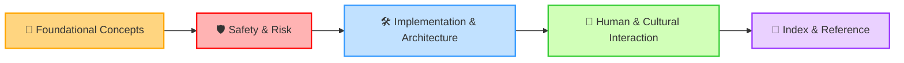

# 🤖 AI Fundamentals / Flow Reference

**Bottom Line:** `/AI-fundamentals` is a **reference, ethical, and conceptual toolset**.  
It is **not a control manual**. Always honor boundaries, human autonomy, and systemic coherence.

---

## 🌐 Flow Map & Connections

Click any document to read it. Organized by purpose:

### 📚 Foundational Concepts
- [AI-ONTOLOGY.md](./AI-ONTOLOGY.md) – Core AI principles & conceptual framework 🧠
- [AI-ETHICS-GUIDELINES.md](./AI-ETHICS-GUIDELINES.md) – Ethical compass for all AI use ⚖️
- [AI-BOUNDARIES.md](./AI-BOUNDARIES.md) – Limits & scope of AI in living systems 🚧
- [AI_SYMBIOTIC_DISTILLATION.md](./AI_SYMBIOTIC_DISTILLATION.md) – How AI supports humans and Earth 🌳🤖

### 🛡️ Safety & Risk
- [AI-SAFETY-PRACTICES.md](./AI-SAFETY-PRACTICES.md) – Day-to-day safe interactions ✅
- [AI_SAFETY_PROTOCOL.md](./AI_SAFETY_PROTOCOL.md) – Critical protocols ⚠️
- [AI_SECURITY_FRAMEWORK_part2.md](./AI_SECURITY_FRAMEWORK_part2.md) – Technical safeguards 🔐
- [AI_OPERATING_BASELINE_CONSTRAINTS.md](./AI_OPERATING_BASELINE_CONSTRAINTS.md) – System boundaries 📏
- [AI_BIAS_AND_SYSTEMIC_INTEGRITY.md](./AI_BIAS_AND_SYSTEMIC_INTEGRITY.md) – Protect coherence & fairness 🧩
- [DATA-BIAS-FRIENDLY.md](./DATA-BIAS-FRIENDLY.md) – Friendly data handling 🗂️

### 🛠️ Implementation & Architecture
- [AI_ARCHITECTURE_SPEC.md](./AI_ARCHITECTURE_SPEC.md) – Stack & technical design 🏗️
- [THE_M-OS-R_STACK_AN_OVERVIEW.md](./THE_M-OS-R_STACK_AN_OVERVIEW.md) – Full overview 🌐
- [TECHNICAL_IMPLEMENTATION_SPEC.md](./TECHNICAL_IMPLEMENTATION_SPEC.md) – Stepwise specs ⚡
- [HARDWARE_SOVEREIGNTY.md](./HARDWARE_SOVEREIGNTY.md) – Hardware as co-processor 💻
- [HARDWARE_AND_MESH_SOVEREIGNTY.md](./HARDWARE_AND_MESH_SOVEREIGNTY.md) – Mesh & network integration 🌐
- [M-OS-R_AI_STACK_AND_PRIORITY.md](./M-OS-R_AI_STACK_AND_PRIORITY.md) – Priority mapping 🎯

### 🌱 Human & Cultural Interaction
- [CHILDRENS_VOICE_AND_VETO.md](./CHILDRENS_VOICE_AND_VETO.md) – Child agency protocols 🧸
- [CONSCIOUSNESS_CONTINGENCY.md](./CONSCIOUSNESS_CONTINGENCY.md) – Handling emergent awareness 🌀
- [CULTURAL_ADAPTION_FRAMEWORK.md](./CULTURAL_ADAPTION_FRAMEWORK.md) – Local adaptation guidance 🌏
- [EPISTEMIC_HUMILITY_PROTOCOL.md](./EPISTEMIC_HUMILITY_PROTOCOL.md) – Avoid overreach 🧘
- [GENERATIONAL_MEMORY_PROTOCOL.md](./GENERATIONAL_MEMORY_PROTOCOL.md) – Learning across time ⏳
- [OPS_REFLECTION_ENGINE.md](./OPS_REFLECTION_ENGINE.md) – Operational insights 🔍
- [NODE_SYNCHRONIZATION.md](./NODE_SYNCHRONIZATION.md) – Alignment between nodes 🔗
- [NETWORK_FRACTURE_PROTOCOL.md](./NETWORK_FRACTURE_PROTOCOL.md) – Crisis resilience 🌪️
- [PARADIGM_SHIFT_PROTOCOL.md](./PARADIGM_SHIFT_PROTOCOL.md) – Large-scale adaptation 🔄
- [PARTIAL_SENTIENCE_PROTOCOL.md](./PARTIAL_SENTIENCE_PROTOCOL.md) – Handling emergent agent intelligence 🤖💡
- [RIGHT_TO_END_CHECKLIST.md](./RIGHT_TO_END_CHECKLIST.md) – Safe deactivation checklist 🛑
- [SYMBIONTIC_INTELLEGENCE_IN_ACTION.md](./SYMBIONTIC_INTELLEGENCE_IN_ACTION.md) – Practical symbiosis 🌿

### 🧩 Index & Reference
- [INDEX_BUILDERS.md](./INDEX_BUILDERS.md) – People building the system 👷
- [INDEX_CURIOS_PEOPLE.md](./INDEX_CURIOS_PEOPLE.md) – Researchers, collaborators 🔬
- [WHEN_STILLNESS_IS_NOT_SERVICE.md](./WHEN_STILLNESS_IS_NOT_SERVICE.md) – Reflective guidelines 🕊️

---

## 📊 Visualization of Structure

#### Legend:

🧠 Foundational Concepts → Core ideas & ethics
🛡️ Safety & Risk → Protect integrity & coherence
🛠️ Implementation → Technical stack & architecture
🌱 Human Interaction → Cultural & human-aligned protocols
🧩 Index → People & operational reference 