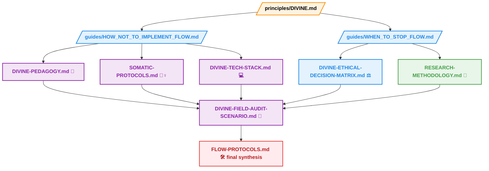

# 📦 ANNEX – DIVINE Reference & Safeguard Layer ✨

> **Protecting the DIVINE framework from misuse, extraction, and commodification.**  
> Reflection, ethical practice, and field integrity – **no KPIs, no gamification, no dashboards.**

---

## 🛡️ Core Principles

💖 **Care over efficiency**  
🧩 **Coherence over shortcuts**  
🪞 **Reflection over measurement**  
🌌 **Field integrity over scalability**  
❌ No KPIs, leaderboards, or productivity metrics  

> **Mandatory Reading Order:**  
> 1. `/principles/DIVINE.md` – Foundational theory 🌟  
> 2. `/guides/HOW_NOT_TO_IMPLEMENT_FLOW.md` – Dead-field prevention ⚡  
> 3. `/guides/WHEN_TO_STOP_FLOW.md` – Stopping rules ⏳  

---

## 📂 Annex Documents Overview

### 1️⃣ Ethics & Safety 🛡️
- [`WHEN-TO-STOP.md`](./WHEN-TO-STOP.md) – Ethical & systemic stopping rules ⏳  
- [`HOW-NOT-TO.md`](./HOW-NOT-TO.md) – Common pitfalls & dead-field scenarios ⚡  
- [`DIVINE-PSYCHOLOGICAL-SAFETY-PROTOCOL.md`](./DIVINE-PSYCHOLOGICAL-SAFETY-PROTOCOL.md) – Trauma-informed participation 🧠  
- [`OBSERVER-TRAUMA.md`](./OBSERVER-TRAUMA.md) – Observer safeguards 🛡️  
- [`DIVINE-ETHICAL-DECISION-MATRIX.md`](./DIVINE-ETHICAL-DECISION-MATRIX.md) – Ethical decision framework ⚖️  
- [`FAILURE-RECOVERY.md`](./FAILURE-RECOVERY.md) – Recovery protocols 🔄  
- [`PSI-COLLAPSE-RECOVERY.md`](./PSI-COLLAPSE-RECOVERY.md) – Field collapse interventions ⚡  
- [`DIVINE_LIMITATIONS_AND_FAILURE_MODES.md`](./DIVINE_LIMITATIONS_AND_FAILURE_MODES.md) – Known limitations ⚠️  
- [`DIVINE_FAILURE_CASE_SIMULATIONS.md`](./DIVINE_FAILURE_CASE_SIMULATIONS.md) – Simulation exercises 🧪  

### 2️⃣ Measurement & Phenomenology 📏
- [`DIVINE-MEASURE.md`](./DIVINE-MEASURE.md) – Conceptual measurement framework 📝  
- [`DIVINE-MEASURE-LOG-v3.1.md`](./DIVINE-MEASURE-LOG-v3.1.md) – Observation log 📊  
- [`DIVINE-MEASURE-POETIC.md`](./DIVINE-MEASURE-POETIC.md) – Poetic, reflective measurement ✨  
- [`EV-MEASURE.md`](./EV-MEASURE.md) – Event & variation measurement ⚡  
- [`SIGMA_PHENOMOLOGY.md`](./SIGMA_PHENOMOLOGY.md) – Σ / Grace phenomenology 🌌  

### 3️⃣ Cultural & Contextual Calibration 🌱
- [`CULTURAL-CALIBRATION.md`](./CULTURAL-CALIBRATION.md) – Local context & culture tuning 🌍  
- [`DIVINE-CONTEXTUAL-CALIBRATION-PROTOCOL.md`](./DIVINE-CONTEXTUAL-CALIBRATION-PROTOCOL.md) – Applied calibration protocols 🛠️  
- [`INDIGENOUS-WISDOM.md`](./INDIGENOUS-WISDOM.md) – Traditional knowledge guidance 🪶  

### 4️⃣ Applied Practice 🏗️
- [`PEDAGOGY.md`](./PEDAGOGY.md) – Teaching DIVINE as a thinking language 🎓  
- [`SOMATIC-PROTOCOLS.md`](./SOMATIC-PROTOCOLS.md) – Body-based observation 🧘‍♀️  
- [`DIVINE-TECH-STACK.md`](./DIVINE-TECH-STACK.md) – Minimal & ethical tooling 💻  
- [`THREE_PILLARS_FIELD_AUDIT_SCENARIO.md`](./THREE_PILLARS_FIELD_AUDIT_SCENARIO.md) – Field audit scenario 🕵️  
- [`DIVINE-FIELD-AUDIT-SCENARIO.md`](./DIVINE-FIELD-AUDIT-SCENARIO.md) – Practical field audit 🛠️  

### 5️⃣ Meta & Long-Term Stewardship 🔮
- [`FINAL META-DOKUMENT: WHAT-REMAINS.md`](./FINAL%20META-DOKUMENT:%20WHAT-REMAINS.md) – Reflections on enduring practices ⏳  
- [`DIVINE-FAQ.md`](./DIVINE-FAQ.md) – Common questions & clarifications ❓  

---

## 💡 Tips for Use
1. Read **slowly**, absorb before acting 🐢  
2. Engage **multi-modally**: write, move, discuss, reflect 🎨  
3. Pair documents for depth: pedagogy + somatics, tech + legal, research + observation 🔗  
4. **FLOW-PROTOCOLS.md** is the last, actionable field companion 🛠️  
5. Encourage **discussion**, never certification, scoring, or KPIs 💬  

---

## 🌐 Annex Flow Map & Connections 🧭

## Ψ ≠ 0 – the field protects itself. 
