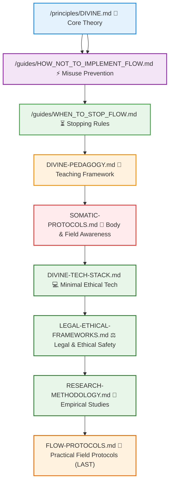

# 📦 Annex – Reference & Safeguard Layer for the DIVINE Framework ✨

> This folder contains **protective, conceptual, and practical reference materials** for DIVINE.  
> Purpose: **prevent misuse, preserve systemic coherence, and ensure ethical practice**.  
>  
> **No KPIs. No dashboards. No optimization games.**  
> Only **reflection, awareness, and field integrity**.

---

## 🔑 Final Reminder

DIVINE is **not about efficiency, KPIs, or control**.  
It is about:  
💖 **Care**  
🧩 **Coherence**  
🪞 **Reflection**  
🌌 **Field integrity**  

**Honor the field, honor stopping rules, and honor human autonomy.**  
This is your **safeguard layer**. Handle with respect.

---

## ⚡ Ethics & Anti-KPI Reminder

- 🚫 No KPIs, dashboards, gamification, or productivity metrics  
- 🚫 No ranking of individuals, teams, or groups  
- 🚫 No certifications, compliance scores, or leaderboards  

**Focus instead on:**  
🪄 Reflection & sense-making  
🛡 Ethical and trauma-informed practice  
🌐 Context-sensitive observation  
🫂 Human-centered awareness  

Observations **must always connect to:**  
📍 Context  
📍 Consent  
📍 Lived experience  

---

## 💡 Tips for Accessibility & Use

1. 🐢 Read **slowly**, absorb before acting.  
2. 🎨 Engage **multi-modally**: write, move, discuss, reflect.  
3. 🔗 Pair documents for depth:  
   - pedagogy + somatics  
   - tech + legal  
   - research + observation  
4. 📖 Use `FLOW-PROTOCOLS.md` as a **field companion**, last in reading order.  
5. 💬 Encourage **discussion and reflection**, never ranking or KPIs.  

---

## 📝 Mandatory Reading Order

Before engaging with annex materials, read **in order**:

1. **`/ethos/DIVINE.md`** 🌟 – Foundational theory: DIVINE framework & Frejd Equation.  
2. **`/guides/HOW_NOT_TO_IMPLEMENT_FLOW.md`** ⚡ – Common misuses, dead-field scenarios, and systemic pathologies.  
3. **`/guides/WHEN_TO_STOP_FLOW.md`** ⚡ – Ethical, psychological, and systemic stopping rules.  

> Skipping this order risks misunderstanding, harm, or irreversible field degradation.

---

## 📂 Annex Documents

### 1️⃣ `DIVINE-PEDAGOGY.md` – Teaching DIVINE Without Dogma 🏫
**Purpose:** Introduce DIVINE as a **thinking language**, not a belief system or manual.  

**Focus:**  
- 🌱 Lived experience first  
- 🕳 Teaching through negative space (blockages)  
- 🛡 Anti-dogma inoculation  
- 🎭 Multi-modal learning  

**Connected guides:**  
`HOW_NOT_TO_IMPLEMENT_FLOW.md`, `WHEN_TO_STOP_FLOW.md`

---

### 2️⃣ `SOMATIC-PROTOCOLS.md` – Embodied Field Awareness 🧘
**Purpose:** Support somatic literacy and body-based observation of Ψ.  

**Focus:**  
- 🌬 Pre-observation grounding  
- 🫁 Somatic signals for L, S, I  
- 🛡 Trauma-informed participation  
- ✅ Consent and opt-out boundaries  

---

### 3️⃣ `DIVINE-TECH-STACK.md` – Minimal & Ethical Tooling 💻
**Purpose:** Describe technical support without surveillance or extraction.  

**Principles:**  
- 📉 Data minimalism  
- 🏠 Local-first by default  
- ⏳ Ephemeral storage (auto-delete)  
- 🚫 No individual tracking  

**Explicit anti-features:**  
No analytics, no prediction engines, no optimization loops.

---

### 4️⃣ `LEGAL-ETHICAL-FRAMEWORKS.md` – Legal Safety & Compliance ⚖️
**Purpose:** Prevent legal and ethical violations across contexts.  

**Coverage:**  
- 🛡 GDPR & data protection  
- ⚖️ Employment law considerations  
- 👶 Work with minors  
- 🌍 Cross-border use  
- 📝 Ethics review & liability boundaries  

---

### 5️⃣ `RESEARCH-METHODOLOGY.md` – Studying DIVINE Responsibly 🔬
**Purpose:** Enable empirical exploration without reductionism.  

**Focus:**  
- 🧪 Mixed methods  
- 🏃 Small-scale pilots  
- 🌐 Cross-cultural calibration  
- 📅 Longitudinal patterns  
- Σ-event mapping  

**Always pair with:**  
- `HOW_NOT_TO_IMPLEMENT_FLOW.md`  
- `WHEN_TO_STOP_FLOW.md`  

---

### 6️⃣ `FLOW-PROTOCOLS.md` – Practical Field Observation (LAST) 🛠️
**Purpose:** Concrete, step-by-step observation tools.  

**Includes:**  
- 🏗 Session setup  
- 📊 L / S / I observation cues  
- 🩰 Somatic, relational, narrative signals  
- 📝 Documentation templates  
- 🛡 Trauma-aware reminders  

**Placement:**  
This file is **last on purpose**, synthesizing all previous annex material into careful practice.

---

## 📎 Measurement & Observation 📏

- **`/annex/DIVINE-MEASURE.md`** – Conceptual and qualitative measurement framework for Ψ.  
  For **reflection and audit** — not performance evaluation.  

---

## 🌐 Flow Map & Connections 🧭

> Bottom line: Annex materials are reference, audit, and ethical tools, not control manuals.
Honor stopping rules, local autonomy, and systemic coherence.

# Ψ ≠ 0 The field protects itself. 