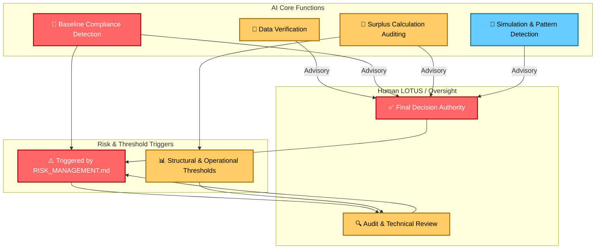

# AI_INTEGRATION_PROTOCOL.md
## Version 1.1
## Status: ACTIVE
## Scope: Global
## Amendment Requirement: 66% Global LOTUS Majority

---

# PURPOSE

This protocol defines the role of Artificial Intelligence within Flow.

AI exists to:

• Analyze  
• Verify  
• Simulate  
• Detect anomalies  

AI does not govern.  
AI does not vote.  
AI does not override human LOTUS authority.  

Human sovereignty remains absolute.

---

# I. AI ROLE DEFINITION

AI functions are limited to:

1. Data verification  
2. Surplus calculation auditing  
3. Baseline compliance detection (linked to `RISK_MANAGEMENT.md` thresholds)  
4. Simulation of proposed amendments  
5. Pattern detection (hoarding, stagnation, instability)  

AI outputs are advisory.  
Final decisions belong to LOTUS.

---

# II. DECISION SEPARATION RULE

No AI system may:

• Cast a vote  
• Trigger redistribution autonomously  
• Modify protocols  
• Override LOTUS decisions  

All automated triggers must require human confirmation.

---

# III. TRANSPARENCY REQUIREMENT

All AI models used must be:

• Open-source or publicly auditable  
• Documented in training data scope  
• Version-controlled  
• Logged when producing governance-relevant output  
• Output logs must be immutable and timestamped  

Black-box authority is prohibited.

---

# IV. MULTI-AI VALIDATION

Critical decisions must use:

• At least two independently developed AI systems  
OR  
• One AI system + human audit committee  

Prevents single-model capture or manipulation.

---

# V. ERROR HANDLING

If AI produces:

• Conflicting outputs  
• Statistically unstable conclusions  
• Bias patterns  

LOTUS must:

• Suspend reliance  
• Trigger technical audit  
• Publish discrepancy report  

AI trust is conditional, not assumed.

---

# VI. PRIVACY PROTECTION

AI may process:

• Aggregated data  
• Anonymized metrics  
• Regional surplus/deficit data  

AI may not:

• Permanently store individual identity data  
• Access private node-level granular data without consent  
• Profile individuals for governance influence

---

# VII. FAIL-SAFE PRINCIPLE

If AI infrastructure fails:

Flow must remain operable through manual processes.  
All AI-dependent processes must be fully bypassable by human operators without loss of continuity.  

AI augments.  
AI does not replace.

---

# VIII. STRUCTURAL AXIOM

Intelligence can assist governance.  
Only humans can legitimize it.  

All AI usage must adhere to `FLOW_CORE_INVARIANTS.md` and `BASELINE_AMENDMENT_PROTOCOL.md`.

