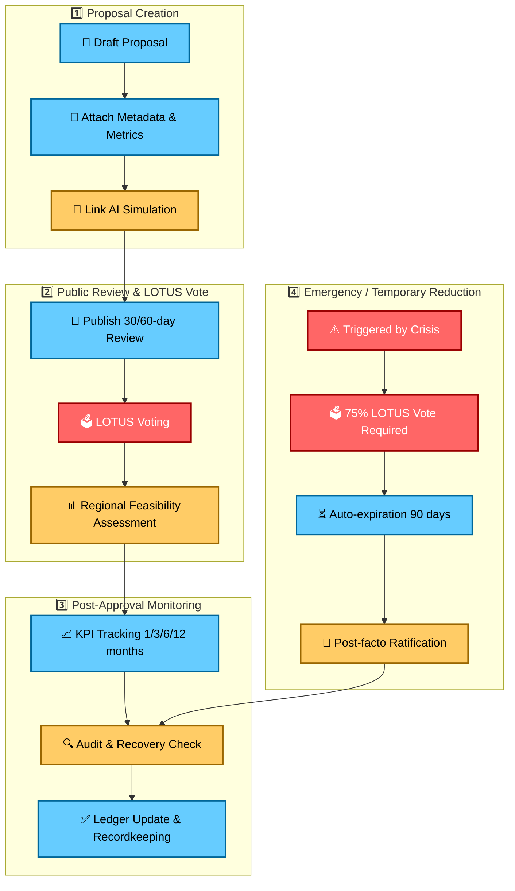

# BASELINE_AMENDMENT_PROTOCOL.md
## Version 1.1
## Status: CONSTITUTIONAL
## Scope: Global
## Applies To: RESOURCE_METRIC_STANDARDS.md
## Date: March 4, 2026

---

# PURPOSE

This protocol defines how the Global Baseline may be amended.

Baseline is the structural floor of Flow.

It must evolve carefully.
It must not be politically destabilized.
All amendment activity is auditable and versioned.

---

# I. APPLICABILITY & PROPOSAL ORIGINS

**Who may propose a Baseline amendment:**
- Regional node quorum (defined in `LOTUS_PROTOCOL.md`), OR
- A LOTUS member, OR
- Federated Oversight panel (when convened).

All proposals must be recorded in the amendment ledger:
```
/compostandgrowth/baseline_amendments/<YYYYMMDD>-<short-id>.md
```
and mirrored per `VERSIONING_AND_COMPOST_POLICY.md`.

**Required proposal metadata (must be present for any valid proposal):**
- Title
- Proponent (node or LOTUS member)
- Metrics affected (links to `RESOURCE_METRIC_STANDARDS.md`)
- Current value(s) and proposed value(s)
- Rationale & evidence summary
- AI simulation summary (or “N/A” if none) — link to full report
- Effective date (proposed)
- Transition timeline (phased steps, region-by-region)
- Regional feasibility statement
- Risk assessment (link to `RISK_MANAGEMENT.md` entries)
- Audit & monitoring plan (who, what, cadence)

---

# II. AMENDMENT CATEGORIES

Baseline actions are classified as:

• **Increase** — raising a baseline metric  
• **Decrease** — lowering a baseline metric  
• **Refinement** — metric clarification or measurement change without changing numeric values

Each category follows distinct thresholds, timelines, and evidence requirements.

---

# III. INCREASING BASELINE (RAISE)

**Requirements:**
- 66% Global LOTUS supermajority (see `LOTUS_PROTOCOL.md` for membership definition)
- 30-day public review period (proposal and supporting docs posted)
- AI simulation report (impact forecast) — at minimum one validated simulation
- Publication of effective date and phased transition timeline
- Regional implementation feasibility statements

**Post-approval obligations:**
- Implementation monitoring at 6/12/24 months (reporting to LOTUS)
- Ledgering of observed metrics vs. forecast (audit reference)

Raising Baseline is considered progressive stabilization.

---

# IV. DECREASING BASELINE (LOWER)

**Requirements:**
- 75% Global LOTUS supermajority
- 60-day public review period
- Mandatory dual-AI simulation (two independently developed models OR one model + human audit committee)
- Regional feasibility audit
- Published justification report (burden of proof on initiators)

**Post-approval obligations:**
- Immediate implementation monitoring (1/3/6/12 months)
- Independent audit within 90 days
- Reversion plan (baseline recovery steps as per `BASELINE_RECOVERY_PROTOCOL.md`) if adverse outcomes exceed agreed thresholds

Lowering Baseline is classified as structural contraction.

---

# V. TEMPORARY REDUCTIONS (EMERGENCY MEASURES)

**Trigger conditions (examples, not exhaustive):**
- Active large-scale war directly disrupting baselines
- Planetary-scale natural catastrophe (global crop/energy collapse)
- Rapid systemic collapse of global critical infrastructure

**Temporary reduction rules:**
- Requires 75% Global LOTUS vote to enact emergency reduction
- Automatic expiration after 90 days unless renewed by the same threshold
- Mandatory post-facto ratification/justification report within 30 days
- All emergency reductions must be clearly labeled in the ledger and archived under `/compostandgrowth` with prefix `EMERGENCY_`

Temporary status must be clearly labeled in all ledgers.

---

# VI. NON-RETROACTIVITY RULE

Baseline reductions:

- Cannot retroactively justify previous deprivation.
- Cannot invalidate prior violation records or past accountability measures.
- Any benefits or obligations applied during a temporary reduction must be explicitly documented.

System accountability remains intact.

---

# VII. REVISION LOCK PERIOD & EXCEPTIONS

**Standard lock:**
- After any Baseline amendment, no further amendment to the same metric may occur for 12 months.

**Exception (emergency only):**
- Emergency override allowed as specified in Section V.

**Exception (rare, non-emergency):**
- To override the 12-month lock (non-emergency), the following are required:
  - ≥ 90% Global LOTUS approval, AND
  - Independent audit signoff, AND
  - Published justification showing material new evidence.

Prevents rapid oscillation and manipulation.

---

# VIII. IMPLEMENTATION, MONITORING & AUDIT

- Approved amendments must include a monitoring plan with explicit KPIs and owners.
- Monitoring cadence: 1 month (if urgent), 3 months, 6 months, 12 months, then annual until stable.
- If post-implementation metrics diverge from forecasted thresholds (see `RISK_MANAGEMENT.md`), the Recovery Protocol is triggered.
- All monitoring reports are published to the ledger and subject to cross-node review.

---

# IX. RECORDKEEPING & VERSIONING

- All proposals, simulations, votes, and monitoring reports are archived under `/compostandgrowth/baseline_amendments/` and versioned per `VERSIONING_AND_COMPOST_POLICY.md`.
- No amendment-related record may be permanently deleted; entries may be marked: Mitigated / Deprecated / Absorbed / Resolved (with audit reference).
- Amendment files must include immutable timestamps and hash references for auditability.

---

# X. STRUCTURAL AXIOM

Raising dignity should be easier than lowering it.

Stability depends on asymmetry in favor of protection.

---

# XI. REFERENCES

- `RESOURCE_METRIC_STANDARDS.md`  
- `RISK_MANAGEMENT.md`  
- `BASELINE_RECOVERY_PROTOCOL.md`  
- `LOTUS_PROTOCOL.md`  
- `VERSIONING_AND_COMPOST_POLICY.md`

