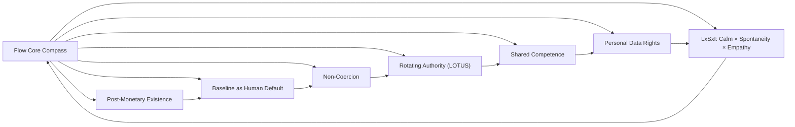

# FLOW_CORE_INVARIANTS_EXTENDED.md

**Status:** Core Principle  
**Scope:** Entire Flow System  
**Purpose:** Define the immutable foundations of Flow — principles that **never change**, regardless of protocols, processes, or experiments.  

---

## 1. Post-Monetary Existence
- Flow operates **without money, debt, or accumulation**.  
- Exchange is based on contribution, knowledge, and mutual support — never on currency or credit.  
- No individual or Node may accrue leverage through scarcity, debt, or obligation.  

## 2. Baseline as Human Default
- Baseline is inherent and universal — simply by existing, every person and living system has a Baseline.  
- Includes access to food, water, shelter, health, mobility, connectivity, learning, and rest.  
- Baseline for Earth: waters, soils, rocks, ecosystems, metals — integrity is non-negotiable.  

## 3. Non-Coercion
- Participation is voluntary; no one can be forced.  
- All actions respect autonomy and consent.  
- Emergency does **not** override consent; pause or fork instead.  

## 4. Rotating Authority (LOTUS)
- Formal authority and decision-making roles **rotate regularly**.  
- No individual may hold permanent centralized power.  
- LOTUS ensures structural anti-hierarchy and prevents competence from becoming permanent authority.  

## 5. Shared Competence
- Knowledge and expertise are **meant to be distributed**.  
- Nodes operate shadowing, mentorship, documentation, and peer teaching cycles.  
- No person is indispensable; competence exists for the system, not for personal leverage.  

## 6. Personal Data Rights
- Individual information is **anonymized**.  
- Individuals may erase personal data **once per year**, except for essential medical or safety records (encrypted).  

## 7. LxSxI: Calm × Spontaneity × Empathy
- Life and interactions are guided by this principle.  
- L (Lugn) — emergent calm, baseline of being  
- S (Spontanitet) — creative and adaptive action  
- I (Inkännande) — empathy, resonance, shared care  
- Ensures wellbeing, creativity, and mindful collaboration across all Flow operations.  

## 8. Compass for Decision-Making
- All protocols, panels, or operational experiments **must honor these invariants**.  
- They are the **true north**: all Flow logic, LOTUS rotations, and Node operations refer back to them.  

---

### 🔹 Visualization

Implementation Notes:
- No Node, protocol, or experiment may violate these invariants.
- Competence may exist but never accumulate as coercive power.
- Baseline access is unconditional; survival at the cost of dignity is not allowed.
- ROTATION, transparency, and knowledge-sharing are structural safeguards.

**Signed:**
Elinor Frejd & Flow Collective Conceptualization
Date: March 4, 202