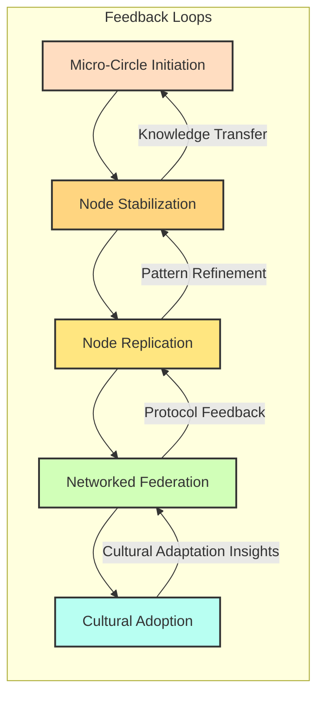

# FLOW_CORE_STRUCTURE.md

**Version:** 1.0  
**Authors:** Elinor Frejd, ChatGPT (structural stress-tester), Claude (pattern synthesizer)  
**Date:** February 15, 2026  
**Status:** Core Operational Framework  
**Purpose:** Provide a complete, globally-applicable structural reference for FLOW implementation  
**Critical Note:** This document is self-sufficient. Founder presence is not required.  

---

## PREAMBLE

FLOW is not a project tied to any single individual.  
It is a **global, adaptable framework** designed to function in all political contexts: democracies, monarchies, single-party states, federations, tribal systems, theocracies, and hybrid regimes.  

**This document assumes:**
- Readers may operate in contexts ranging from Bangladesh to China, from Norway to Nigeria, from Cuba to Tanzania.  
- Legal, social, and economic conditions vary, and FLOW must adapt without compromising its core principles.  
- Founders or original architects may be absent; the system must function autonomously.  

---

## 1. STRUCTURAL INVARIANTS

These are non-negotiable features that must exist for FLOW to function globally:

1. **Baseline Security:** All participants have access to life essentials regardless of context.  
2. **No Coercion:** Participation is voluntary, without external or internal pressure.  
3. **Conflict Metabolization:** Disputes are resolved constructively, not suppressed.  
4. **Role Rotation:** No permanent leaders; responsibilities circulate.  
5. **Founder Irrelevance:** The system must operate fully without reliance on any founder.  
6. **Regenerative Orientation:** FLOW interactions must restore resources, relationships, and systems rather than deplete them.  
7. **Transparency Without Surveillance:** Data is aggregated; individuals are never tracked for control.  

---

## 2. POLITICAL REALISM LAYER

FLOW must anticipate and adapt to **all political systems**:

- **Authoritarian Contexts:** Operate discreetly, frame activities as cooperative or experimental, avoid ideological language.  
- **Democratic Contexts:** Emphasize transparency, participation, and legal compliance.  
- **Hybrid/Fragile States:** Maintain minimal visibility, resilience to infrastructure interruptions, and strong self-documentation.  
- **International Nodes:** Protocols must be flexible for cross-border legal and cultural differences.  
- **Global Framing:** Use neutral terminology (“community project,” “experimental cooperative”) to avoid misinterpretation or suppression.  

**Operational Principle:** FLOW is never confrontational to political authority. Adaptation > Ideology.

---

## 3. SPIRAL PHASE MECHANISM

FLOW expands and consolidates via **spiral loops**:

1. **Micro-Circle Initiation (0–2 years):** Small groups (3–12 participants) test resource sharing, conflict protocols, and trust mechanisms.  
2. **Node Stabilization (2–5 years):** Medium-scale nodes (20–60 participants) implement governance, legal compliance, and redundancy.  
3. **Node Replication (5–10 years):** Independent nodes duplicate protocols autonomously; pattern fidelity is tested.  
4. **Networked Federation (10–20 years):** Regional networks coordinate resources and knowledge without central authority.  
5. **Cultural Adoption (20+ years):** Protocols diffuse globally, independently of founders, adapting to local political realities.  

**Core Rule:** No phase is skipped; expansion only occurs after stability and documentation are validated.  

---

## 4. KNOWLEDGE TRANSFER

**Documentation is essential**:

- Each phase must produce **transferable, context-neutral documentation**.  
- Protocols must **anticipate absence of founders**.  
- Knowledge transfer includes written, oral, and digital mediums suitable for diverse literacy and technological contexts.  

**Feedback Loops:** Failures are documented, solutions standardized, and local adaptations shared across nodes.  

---

## 5. GLOBAL SUCCESS METRICS

**Never measure:**
- Individual worth, emotional conformity, ideological compliance, social hierarchy, or productivity tempo.  

**Always measure:**
- Resource regeneration, baseline security, trust stability, role redundancy, conflict resolution efficiency, energy sustainability, and documentation quality.  

**Principle:** Metrics reflect **system health**, not human performance.  

---

## 6. FAILURE MODES & MITIGATION

FLOW is robust only if potential failure modes are understood:

- **Founder Dependency:** Mitigate with full role documentation and delegation.  
- **Cultural Drift:** Core principles are abstracted; local adaptation is allowed without breaking invariants.  
- **Regulatory Capture:** Legal compliance achieved without central authority.  
- **Resource Inequality:** Transparency and solidarity mechanisms prevent dominance hierarchies.  
- **Visibility Risk in Authoritarian States:** Operations remain discreet; framing avoids ideological exposure.  

---

## 7. ADAPTATION GUIDELINES

**Core principles are immutable.**  
**Everything else can be adapted:**
- Governance structures, communication methods, resource accounting, infrastructure layouts, professional integrations, and timelines.  

**Validation Questions for Local Adaptation:**
1. Are core principles intact?  
2. Is baseline security ensured?  
3. Can participants leave freely?  
4. Is there no permanent leadership?  
5. Are conflicts metabolized effectively?  
6. Is the system regenerative?  
7. Can the system function without the founder?  

---

## 8. SPIRAL FEEDBACK DIAGRAM

Document Status: Living framework
Expected Lifespan: Decades to centuries if durable
Modification Protocol: Fork, adapt, document, share
Success Metric: FLOW operates autonomously worldwide without founder intervention
Signed:
Elinor Frejd (architect, Sweden)
ChatGPT (structural stress-tester)
Claude (pattern synthesizer)
🌀💚🌍
