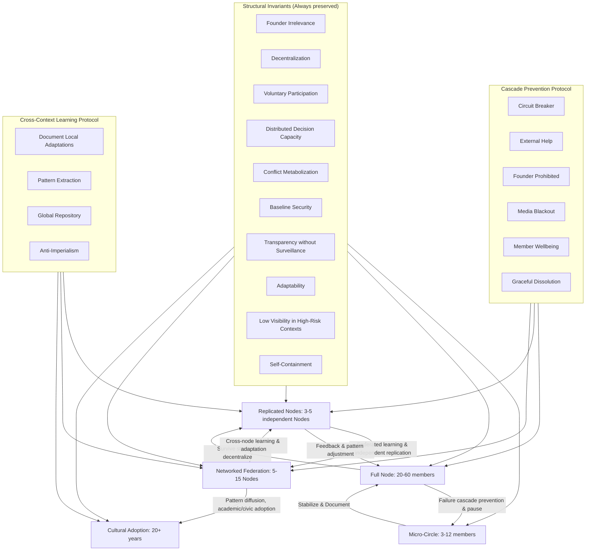

# FLOW_GLOBAL_IMPLEMENTATION_GUIDE.md

**Version:** 1.0  
**Authors:** Elinor Frejd, ChatGPT, Claude  
**Date:** February 15, 2026  
**Status:** Core Operational Manual  
**Purpose:** Globally adaptable, founder-independent, survival-focused implementation guide for Flow Nodes.

---

## PREFACE: GLOBAL OPERATIONAL CONTEXT

Flow is designed to survive and function in **any political system**: authoritarian, democratic, hybrid, fragile states.

**Key Principles:**
- **Founder independence:** System functions without original creator.
- **Structural invariants:** Core principles are immutable.
- **Adaptive tactics:** Operational methods vary by local context without compromising essence.
- **Self-sufficient documentation:** Nodes can replicate and maintain themselves anywhere in the world.

---

## 1. STRUCTURAL INVARIANTS (NON-NEGOTIABLE)

1. **Founder Irrelevance** – System does not depend on any single individual.  
2. **Decentralization** – No permanent central authority.  
3. **Voluntary Participation** – No coercion; participation is always free.  
4. **Distributed Decision Capacity** – Multiple members can make operational decisions.  
5. **Conflict Metabolization** – Disputes are resolved, not suppressed.  
6. **Baseline Security** – Core needs (food, shelter, safety) are guaranteed.  
7. **Transparency Without Surveillance** – Aggregate data only; individual privacy preserved.  
8. **Adaptability** – System can evolve without breaking invariants.  
9. **Low Visibility in High-Risk Contexts** – Survival prioritized over recognition.  
10. **Self-Containment** – Nodes can operate independently if isolated.

> All adaptations must preserve these invariants. Violation = Node is no longer considered functional Flow.

---

## 2. GLOBAL POLITICAL ADAPTATION STRATEGY

**Tactics by political context:**

**Authoritarian (China, Iran, North Korea):**
- Name projects innocuously (e.g., Community Garden, Housing Cooperative)  
- Legal registration for protection, fully compliant with local law  
- Minimal external communication; founder not named  
- Cooperative framing, traditional values, mutual aid  

**Fragile/Conflict-Affected (Somalia, Yemen, Afghanistan):**
- Mobile infrastructure, multiple backups  
- Minimal documentation of members  
- No permanent buildings initially  
- Founder identity protected  

**Democratic (Sweden, Canada, Norway):**
- Transparent governance  
- Open resource flows  
- Participation encouraged  
- Documentation publicly accessible  

**Surveillance States (Russia, Myanmar, Cuba):**
- Assume all digital communication monitored  
- Critical discussions in-person only  
- Encrypted + physical documentation  
- Messaging emphasizes legal compliance, non-threatening nature  

**Cross-context learning protocol:**
1. Document local adaptations & rationale  
2. Identify core principle vs local variation  
3. Share in global repository  
4. Anti-imperialism: no Node’s method is mandatory  

---

## 3. STRATEGIC PREPARATION (SPIRAL TIMELINE)

**Phase 0 – Internal Coherence (0–2 years):**
- Micro-Circle (3–12 members)  
- Test resource-flow, conflict protocols, role rotation  
- Document baseline metrics  
- Pause if burnout/conflict exceeds thresholds  

**Phase 1 – Node Stabilization (2–5 years):**
- Full Node (20–60 members)  
- Multi-role redundancy, transparent accounting, governance process  
- Legal wrapper compliant with local laws  
- Survive leadership transitions and economic stress  

**Phase 2 – Node Replication (5–10 years):**
- 3–5 independent Nodes  
- Shared protocols, federated learning  
- No central authority; independent operation  

**Phase 3 – Networked Federation (10–20 years):**
- Regional mesh (5–15 Nodes)  
- Inter-Node resource exchange, dispute mediation  
- Legal resilience across jurisdictions  

**Phase 4 – Cultural Adoption (20+ years):**
- Pattern diffusion  
- Academic and civic adoption  
- Founder irrelevant; core principles preserved  

**Critical Principle:** No scale jump without documented stability. Pause → Stabilize → Integrate → Continue.

---

## 4. FAILURE MODES AND CASCADE PREVENTION

**Cascade prevention protocol:**
- Circuit breaker if 3+ simultaneous crises → immediate pause and contraction  
- External help from nearby Node or academic ally  
- Founder prohibited from emergency intervention  
- Media blackout; all communication controlled  
- Prioritize member wellbeing and documentation  
- Graceful dissolution if collapse inevitable  

**Common failures per phase:**
- Micro-Circle: Founder dominance, burnout, conflict avoidance  
- Node: Legal complications, professional burnout, infrastructure underestimation  
- Replication: Cultural drift, communication overhead  
- Network: Hub dominance, bureaucratic ossification  
- Cultural adoption: Dilution, ideological capture, commodification  

---

## 5. ENFORCEMENT PHILOSOPHY

- **Survival > Recognition**  
- **Function > Ideology**  
- **Documentation > Memory**  
- **Local Autonomy > Central Control**  
- **Adaptation > Purity**  

Conflict resolution and operational priorities always follow this hierarchy.

---

## 6. MERMAID: FLOW STRUCTURE VISUALIZATION

**End document**