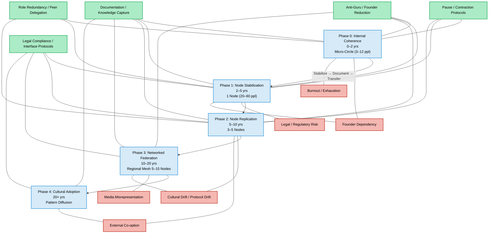

# 🌿 M-OS-R CORE REPOSITORY README 🌿

**Version:** 2.0  
**Status:** Active / Living Framework  
**Last Updated:** February 16, 2026  
**Maintainers:** Elinor Frejd (Architect) & Contributors  

---

## 📌 Overview

Welcome to the **M-OS-R Core Repository**, the living backbone of the **Existensial Reset Manifesto**.  
This repo contains all **operational, structural, and strategic frameworks** needed to implement M-OS-R as a **real-world regenerative system**, independent of founders, and designed for generational longevity.

> ⚠️ **Core Principle:** Scale is a byproduct of **stability**, **documentation**, and **founder irrelevance** — never the goal.

---

## 🗂 Repository Structure

| Folder / File | Description |
|---------------|-------------|
| [`compostandgrowth/`](./compostandgrowth) | Historical versions and archival documents |
| [`CORE_FLOW_PROTOCOLS.md`](./CORE_FLOW_PROTOCOLS.md) | Standardized flow patterns and operational routines |
| [`CORE_GUIDERAIL.md`](./CORE_GUIDERAIL.md) | High-level guiding principles for node governance |
| [`CORE_RESONANCE.json`](./CORE_RESONANCE.json) | Quantitative systemic health metrics and resonance data |
| [`ENTRY_STRATEGIES_DOCUMENTATION.md`](./ENTRY_STRATEGIES_DOCUMENTATION.md) | Micro-to-node onboarding and initiation protocols |
| [`FLOW_CORE_STRUCTURE_OVERVIEW.md`](./FLOW_CORE_STRUCTURE_OVERVIEW.md) | Visual and structural overview of M-OS-R Core |
| [`FLOW_GLOBAL_IMPLEMENTATION_GUIDE.md`](./FLOW_GLOBAL_IMPLEMENTATION_GUIDE.md) | Guidelines for multi-node replication and global adaptation |
| [`M-OS-R_AS_AN_OPERATING_SYSTEM.md`](./M-OS-R_AS_AN_OPERATING_SYSTEM.md) | Architectural explanation of M-OS-R as a functional operating system |
| [`POLITICAL_REALISM_LAYER.md`](./POLITICAL_REALISM_LAYER.md) | External compliance, interface, and political strategy |
| [`README.md`](./README.md) | You are here — entrypoint to the Core |
| [`RESOURCE_METRIC_STANDARDS.md`](./RESOURCE_METRIC_STANDARDS.md) | Definitions of systemic metrics for regenerative evaluation |
| [`STRATEGIC_PREPARATION_FRAMEWORK_VISUAL.md`](./STRATEGIC_PREPARATION_FRAMEWORK_VISUAL.md) | Spiral-based phase visualization & risk-mitigation mapping |
| [`STRATEGIC_PREPARATION_FRAMEWORK_v2.md`](./STRATEGIC_PREPARATION_FRAMEWORK_v2.md) | Updated operational framework with founder-reduction protocols |
| [`STRUCTURAL_INVARIANTS.md`](./STRUCTURAL_INVARIANTS.md) | Non-negotiable system principles ensuring integrity over time |

---

## 💡 Core Principles

1. **Spiral > Speed** 🌀 – Progress is depth-first, not breadth-first  
2. **Robustness > Expansion** 💚 – Structural integrity comes before scale  
3. **Founder Irrelevance** 👤🚫 – System functions independently of any individual  
4. **Pause → Stabilize → Integrate → Continue** ⏸️➡️✅ – Contraction is adaptive, not failure  
5. **Document Everything** 📝 – Knowledge capture is survival  

---

## 📊 Systemic Metrics

**Never Measure** ❌  
- Individual worth  
- Emotional conformity  
- Productivity tempo  
- Ideological alignment  
- Social ranking  

**Always Measure** ✅  
- Resource regeneration rates 🌱  
- Recovery capacity ⚡  
- Conflict resolution time ⏱️  
- Role redundancy 🔄  
- Energy sustainability ♻️  
- Baseline security 🛡️  
- Trust stability 🤝  
- Documentation quality 📚  

> Metrics focus on **systemic health**, not personal surveillance.

---

## 🌀 Spiral Phases

| Phase | Unit | Focus | Duration | Key Goals |
|-------|------|-------|---------|-----------|
| **Phase 0** | Micro-Circle (3–12 ppl) | Internal Coherence | 0–2 yrs | Stabilize structure, document everything, test conflict & role rotation |
| **Phase 1** | Node (20–60 ppl) | Drift Resistance | 2–5 yrs | Multi-role redundancy, legal wrapper, baseline resource tracking |
| **Phase 2** | 3–5 Independent Nodes | Pattern Transferability | 5–10 yrs | Independent replication, shared protocol library, federated learning |
| **Phase 3** | Regional Mesh (5–15 Nodes) | Interoperability | 10–20 yrs | Resource exchange, crisis response coordination, shared metrics |
| **Phase 4** | Pattern Diffusion | Cultural Adoption | 20+ yrs | Academic study, policy adoption, generational memetic durability |

> ⚠️ **No phase jump without documented stability**. Pause protocols automatically trigger on systemic stress.

---

## 📜 Founder Reduction Timeline

| Years | Founder Role | Notes |
|-------|-------------|-------|
| 0–2 | Active | Central execution, decision-making |
| 2–5 | 50% Delegation | Teach, document, share decision-making |
| 5–10 | Advisory | No executive authority, consult only |
| 10–20 | Emeritus | Historical, rarely referenced |
| 20+ | Forgotten | System operates autonomously |

**Goal:** The **system must survive founder absence or death**.  

---

## ⚖️ Political & Legal Realism

- Always legal first ⚖️  
- Transparent resource accounting 💹  
- Frame as **experimental complement**, not revolutionary  
- Cooperate with media, academia, government, NGOs (non-dependent)  
- Decline capital investment 💰 → preserves autonomy  

---

## 🔄 Knowledge Transfer

**Cross-Phase Transfer Rules**  

| From → To | Medium | Key Knowledge |
|-----------|--------|---------------|
| Phase 0 → 1 | Documentation + Oral | Conflict resolution, role rotation, resource flows |
| Phase 1 → 2 | Documentation + Mentorship | Governance, legal wrapper, infrastructure, burnout prevention |
| Phase 2 → 3 | Shared digital commons | Inter-node coordination, resource exchange, dispute mediation |
| Phase 3 → 4 | Academic & open-source | Pattern language, core principles, adaptation guidelines |

> Always **document successes, failures, and adaptations**. Assume founder unavailable.

---

## 📚 Key References

- [CORE_FLOW_PROTOCOLS.md](./CORE_FLOW_PROTOCOLS.md)  
- [CORE_GUIDERAIL.md](./CORE_GUIDERAIL.md)  
- [ENTRY_STRATEGIES_DOCUMENTATION.md](./ENTRY_STRATEGIES_DOCUMENTATION.md)  
- [FLOW_CORE_STRUCTURE_OVERVIEW.md](./FLOW_CORE_STRUCTURE_OVERVIEW.md)  
- [FLOW_GLOBAL_IMPLEMENTATION_GUIDE.md](./FLOW_GLOBAL_IMPLEMENTATION_GUIDE.md)  
- [M-OS-R_AS_AN_OPERATING_SYSTEM.md](./M-OS-R_AS_AN_OPERATING_SYSTEM.md)  
- [POLITICAL_REALISM_LAYER.md](./POLITICAL_REALISM_LAYER.md)  
- [RESOURCE_METRIC_STANDARDS.md](./RESOURCE_METRIC_STANDARDS.md)  
- [STRATEGIC_PREPARATION_FRAMEWORK_VISUAL.md](./STRATEGIC_PREPARATION_FRAMEWORK_VISUAL.md)  
- [STRATEGIC_PREPARATION_FRAMEWORK_v2.md](./STRATEGIC_PREPARATION_FRAMEWORK_v2.md)  
- [STRUCTURAL_INVARIANTS.md](./STRUCTURAL_INVARIANTS.md)  

---

## 🌐 System Visualization

---

## 🌀 Closing Note

This README is the single source of truth for /core structure and philosophy.
All other documents are extensions, visualizations, or historic references in /compostandgrowth.
**✅ Remember:** Founder irrelevance, systemic robustness, and regenerative metrics define success — not speed, fame, or scale.

## 🌱 Build, observe, document, adapt.

**Elinor Frejd** – Architect, Sweden, 2026

& ChatGPT – Structural Stress-Tester, 2026
& Claude – Pattern Synthesizer, 2026

# 🌀💚🌿