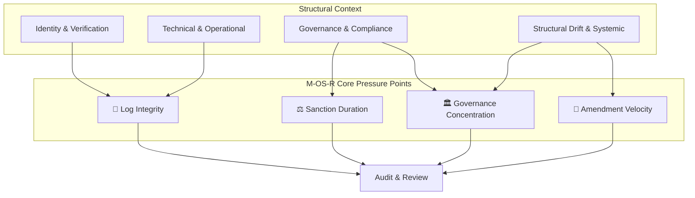

# 🧠 `/core` — Constitutional & Operational Kernel

**Status:** Live  
**Role:** Structural kernel of M-OS-R  
**Scope:** Invariants, enforcement boundaries, identity mechanics, governance logic, version control  

`/core` defines the non-optional structural rules of the system.

This directory functions as the kernel layer of M-OS-R.

It does not define ideology.  
It defines constraints.

---

# 1. System Model

M-OS-R is architected as a layered system:

```
┌─────────────────────────────────────┐
│ LAYER III — Adaptation & Versioning │
│ Amendments, Recovery, Compost, RNG  │
├─────────────────────────────────────┤
│ LAYER II — Operational Infrastructure│
│ Identity, Nodes, Sanctions, Exit    │
├─────────────────────────────────────┤
│ LAYER I — Constitutional Invariants │
│ Structural & Ethical Non-Overrides  │
└─────────────────────────────────────┘
```

Layer I constrains Layer II.  
Layer II executes within Layer I.  
Layer III modifies Layer II — but never bypasses Layer I except through defined amendment procedures.

---

# 2. Layer I — Constitutional Invariants

**Purpose:** Define structural constraints that cannot be overridden by operational convenience.

Files include:

- `CONSTITUTION.md`
- `FLOW_CORE_INVARIANTS.md`
- `STRUCTURAL_INVARIANTS.md`
- `CORE_GUIDERAIL.md`
- `ETHOS_SAFEGUARDS.md`

These documents define:

- Anti-hierarchy constraints  
- Non-extractive baseline  
- Enforcement boundaries  
- Audit requirements  
- Structural rights (exit, federation, transparency)  
- Limits on authority concentration  

If a protocol violates these documents, the protocol is invalid.

Layer I exists to prevent structural drift.

---

# 3. Layer II — Operational Infrastructure

**Purpose:** Execute system behavior inside invariant boundaries.

### Identity & Node Mechanics

- `FLOW_ID.md`
- `FLOW_ID_LIFECYCLE.md`
- `NODE_ROLES.md`

### Information & Coordination

- `CORE_FLOW_PROTOCOLS.md`
- `INFORMATION_FLOW_ARCHITECTURE.md`

### Enforcement & Containment

- `SANCTION_PROTOCOL.md`
- `POWER_AND_ENFORCEMENT.md`
- `RISK_MANAGEMENT.md`
- `NODE_EXIT_PROTOCOL.md`
- `FEDERATED_SUPPORT_PROTOCOL.md`

Operational guarantees:

- No silent power accumulation  
- Enforceable audit trails  
- Defined sanction boundaries  
- Explicit exit mechanics  
- Optional federation  
- Reversibility where structurally possible  

No role is structurally sovereign.

All authority must remain bounded, logged, and challengeable.

---

# 4. Layer III — Adaptation & Version Control

**Purpose:** Allow evolution without destabilizing invariants.

Active governance logic:

- `BASELINE_AMENDMENT_PROTOCOL.md`
- `BASELINE_RECOVERY_PROTOCOL.md`
- `VERSIONING_AND_COMPOST_POLICY.md`
- `LOTUS_PROTOCOL.md`
- `RESOURCE_METRIC_STANDARDS.md`
- `RNG_AND_LOG_SPEC.md`

Archived or superseded documents are stored in:

```
/compostandgrowth/
```

Deletion is avoided.  
Structural history is preserved.

Amendments must follow defined procedure.  
No document self-modifies.  
No structural override is implicit.

Layer III ensures:

- Deterministic amendment pathways  
- Transparent randomness  
- Historical traceability  
- Memory without rigidity  

---

# 5. Kernel Properties

The `/core` directory enforces:

- Deterministic governance mechanics  
- Explicit power boundaries  
- Transparent procedural randomness  
- Defined exit and federation logic  
- Non-permanent enforcement  
- Observable failure states  

Failure must remain detectable.

If `/core` becomes:

- Centralized  
- Opaque  
- Irreversible  
- Hierarchical  
- Self-protective beyond its own constraints  

It violates its own invariants.

---

# 6. Orientation for New Readers

Recommended structural entry path:

1. `FLOW_CORE_STRUCTURE_OVERVIEW.md`
2. `M-OS-R_SYSTEM_MAP.md`
3. `CONSTITUTION.md`
4. `FLOW_CORE_INVARIANTS.md`
5. `RISK_MANAGEMENT.md`

This directory is not a movement.

It is a constraint engine.

Take time before forming conclusions.


```mermaid
flowchart TD
    subgraph FLOW_RISK_OVERVIEW["M-OS-R Core Pressure Points"]
        LogIntegrity["🔐 Log Integrity"]
        SanctionDuration["⚖️ Sanction Duration"]
        GovernanceConcentration["🏛 Governance Concentration"]
        AmendmentVelocity["📝 Amendment Velocity"]
    end

    subgraph STRUCTURAL_LAYERS["Structural Context"]
        Identity["Identity & Verification"]
        Governance["Governance & Compliance"]
        Technical["Technical & Operational"]
        Structural["Structural Drift & Systemic"]
    end

    %% Connections
    Identity --> LogIntegrity
    Technical --> LogIntegrity
    Governance --> SanctionDuration
    Governance --> GovernanceConcentration
    Structural --> GovernanceConcentration
    Structural --> AmendmentVelocity

    %% Outcome
    LogIntegrity --> Audit["Audit & Review"]
    SanctionDuration --> Audit
    GovernanceConcentration --> Audit
    AmendmentVelocity --> Audit
```