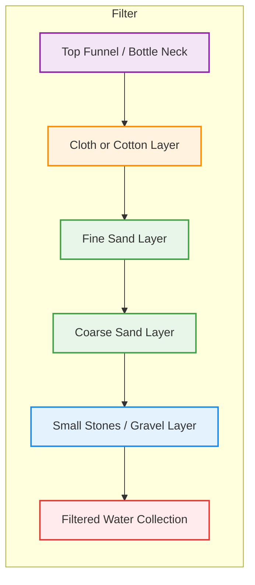

# 🌊 Flow Node Water Filtration Guide
**Ensuring Local Clean Water Without Profit Barriers**

---

## 1️⃣ Principles

Water must be **safe from four threats**:

1. Large particles (sand, dirt, debris)  
2. Chemical contaminants (heavy metals, pesticides)  
3. Microorganisms (bacteria, viruses, parasites)  
4. Taste and odor

This guide focuses on **practical, locally replicable methods** using inexpensive or free materials.

---

## 2️⃣ Materials

- Plastic bottles or buckets  
- Sand, gravel, small stones  
- Activated charcoal (can be made from wood, coconut shells, or charcoal from fires)  
- Cloth, cotton, or coffee filters  
- Sunlight or heat source (fire, stove, solar)

---

## 3️⃣ Step-by-Step Filtration

### A. Mechanical Filtration (Particles)

1. Cut a plastic bottle in half; use the top as a funnel.  
2. Layer materials inside (bottom to top):  
   - Coarse gravel  
   - Fine sand  
   - Cloth or cotton  
3. Slowly pour water through the filter.  
4. Outcome: visibly clear water. **Microorganisms remain at this stage.**  

**Tip:** Keep filter layers clean; replace periodically.

---

### B. Microbial Filtration (Pathogens)

#### 1. Boiling
- Boil water for **at least 5 minutes** to kill bacteria, viruses, and parasites.  
- Higher altitudes may require longer boiling.  

#### 2. Solar Disinfection (SODIS)
- Fill clear PET bottles with water.  
- Expose to **direct sunlight for 6–8 hours** (up to 2 days in cloudy conditions).  
- UV rays neutralize microorganisms.  
- Ideal for small volumes when fuel or stoves are scarce.  

---

### C. Taste and Chemical Improvement

- **Activated charcoal** binds chemical contaminants and improves flavor:  
  - Crush charcoal, rinse, place in filter above sand layer.  
- **Slow filtration** allows water to interact with charcoal and sand for several hours.  

---

### D. Combined Method

**Recommended order for maximum safety and taste:**

`Mechanical → Activated Charcoal → Boiling → SODIS (optional backup)`

- Produces drinkable water without chemicals.  
- Suitable for **Flow Node Circles** and local communities.

---

### E. Maintenance

- Replace sand and gravel regularly  
- Clean all containers and filters  
- Store filtered water in clean containers  
- Check smell and taste; reboil if off

---

## 4️⃣ Flow Node Implementation Tips

- Document local sources and filter designs.  
- Share designs and best practices within the Circle.  
- Build multiple small filters to enable replication by others.  
- Encourage autonomy: anyone can maintain their own clean water.  

---

> **Note:** This is a practical, low-tech guide. Infrastructure, energy, and coordination are needed for larger scale deployment, but local sufficiency is always possible without profit or licensing barriers.

## 🌊 Flow Node Water Filter Diagram

Explanation of Layers (Top → Bottom):

1. Funnel / Bottle Neck – guides water into the filter.
2. Cloth / Cotton Layer – traps fine debris and prevents sand from escaping.
3. Fine Sand Layer – captures smaller particles.
4. Coarse Sand Layer – supports fine sand, slows flow.
5. Gravel / Small Stones – prevents clogging, distributes water evenly.
6. Collection – clean water collects here, ready for boiling, SODIS, or direct use.

This diagram visualizes a simple, locally replicable water filtration system for Flow Node Circles. 
Combine with boiling or solar disinfection for microbial safety.