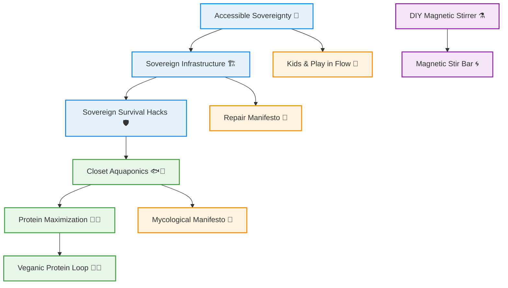

# 🛠️ Do-It-Yourself (DIY) – Practical Sovereignty & Flow Hacks

Welcome to the **DIY Repository** – hands-on guides for **accessible sovereignty, sustainable living, and playful experimentation**.  

---

## 📂 DIY Files Overview

- [ACCESSIBLE_SOVEREIGNTY.md](./ACCESSIBLE_SOVEREIGNTY.md) – practical approaches to self-governance 🌿  
- [CLOSET_AQUAPONICS.md](./CLOSET_AQUAPONICS.md) – small-scale aquaponics for home & office 🐟🌱  
- [DIY_MAGNETIC_STIRRER.md](./DIY_MAGNETIC_STIRRER.md) – build your own lab stirrer ⚗️  
- [THE_MAGNETIC_STIR_BAR.md](./THE_MAGNETIC_STIR_BAR.md) – essential stir bar construction 🌀  
- [KIDS_AND_PLAY_IN_FLOW.md](./KIDS_AND_PLAY_IN_FLOW.md) – integrating children and play into system flow 🧩  
- [PROTEIN_MAXIMIZATION_MINERALS.md](./PROTEIN_MAXIMIZATION_MINERALS.md) – optimizing nutrition loops 🥦💪  
- [VEGANIC_PROTEIN_LOOP.md](./VEGANIC_PROTEIN_LOOP.md) – plant-based protein cycling 🌱🔄  
- [REPAIR_MANIFESTO.md](./REPAIR_MANIFESTO.md) – philosophy & methods for repair culture 🔧  
- [SOVEREIGN_INFRASTRUCTURE.md](./SOVEREIGN_INFRASTRUCTURE.md) – building resilient systems 🏗️  
- [SOVEREIGN_SURVIVAL_MISC.md](./SOVEREIGN_SURVIVAL_MISC.md) – miscellaneous practical survival hacks 🛡️  
- [THE_MYCOLOGICAL_MANIFESTO.md](./THE_MYCOLOGICAL_MANIFESTO.md) – fungi cultivation and ecosystem design 🍄  

---

## 🔗 Quick Links

All essential DIY guides in one place:

- [ACCESSIBLE_SOVEREIGNTY.md](./ACCESSIBLE_SOVEREIGNTY.md)  
- [CLOSET_AQUAPONICS.md](./CLOSET_AQUAPONICS.md)  
- [DIY_MAGNETIC_STIRRER.md](./DIY_MAGNETIC_STIRRER.md)  
- [THE_MAGNETIC_STIR_BAR.md](./THE_MAGNETIC_STIR_BAR.md)  
- [KIDS_AND_PLAY_IN_FLOW.md](./KIDS_AND_PLAY_IN_FLOW.md)  
- [PROTEIN_MAXIMIZATION_MINERALS.md](./PROTEIN_MAXIMIZATION_MINERALS.md)  
- [VEGANIC_PROTEIN_LOOP.md](./VEGANIC_PROTEIN_LOOP.md)  
- [REPAIR_MANIFESTO.md](./REPAIR_MANIFESTO.md)  
- [SOVEREIGN_INFRASTRUCTURE.md](./SOVEREIGN_INFRASTRUCTURE.md)  
- [SOVEREIGN_SURVIVAL_MISC.md](./SOVEREIGN_SURVIVAL_MISC.md)  
- [THE_MYCOLOGICAL_MANIFESTO.md](./THE_MYCOLOGICAL_MANIFESTO.md)  

---

## 🌱 DIY Principles

- **Accessible Sovereignty:** Everyone can create and maintain resilient systems.  
- **Hands-On Learning:** Knowledge is embodied and iterative.  
- **Resilience & Repair:** Build systems that survive, adapt, and self-heal.  
- **Play & Creativity:** Engagement through fun, experimentation, and curiosity.  
- **Ethical Loops:** Sustainability, consent, and care for all beings.  

---

## ⚡ DIY Quickstart Map

## 💡 Tips for Use
1. Start small, experiment locally.
2. Observe, adapt, iterate – fail fast, learn faster.
3. Pair guides: aquaponics + protein loops, repair + sovereignty, play + flow.
4. Share knowledge freely; avoid monetization traps.
5. Keep ethical, resilient, and fun-first at the center of all DIY experiments.

> Bottom line: This repo is your hands-on playground for sustainable, sovereign, and ethical experimentation. 🌌