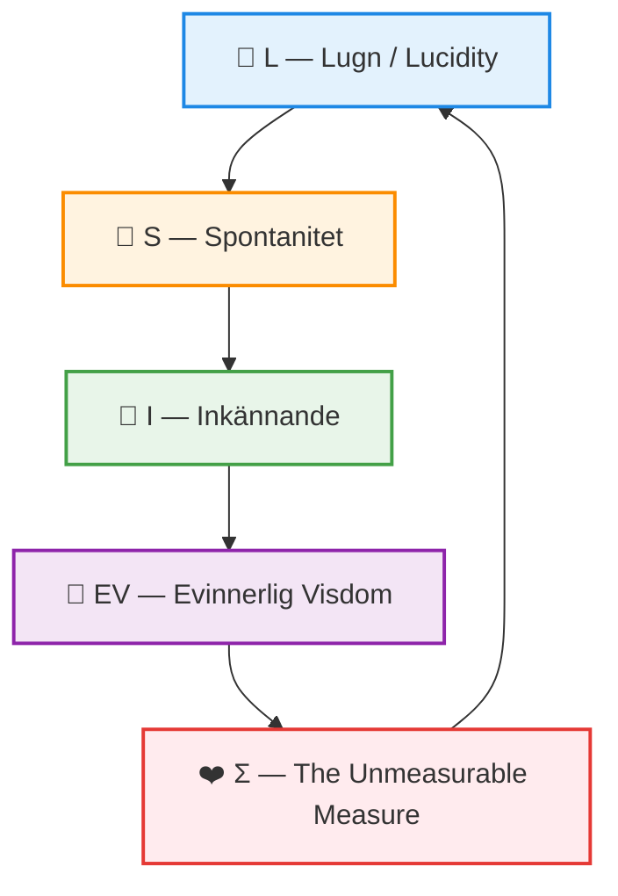

# 🦋 M-OS-R — Existential Sovereignty Operating System  
**An operating system for a post-scarcity humanity**

> *Human beings should not have to earn the right to exist.*

**Author:** Elinor Frejd  
**Status:** Living System / Open Framework  
**Core Equation:** `Life = L × S × I (+ Σ)`  
**Ethical Root:** EV — *Evinnerlig Visdom*

---

## 🌍 What This Is

**M-OS-R** is not an ideology, a platform, or a policy package.  
It is a **systemic framework** for designing societies where:

- survival is unconditional  
- dignity is non-negotiable  
- time, care, and meaning are not commodified  
- technology serves life — never the reverse  

M-OS-R reframes economics, governance, AI, and infrastructure as **tools for restoring Flow** rather than extracting value.

---

## 🧭 Core Variables (Non-Negotiable Definitions)

These variables appear throughout the system.  
They are **descriptive lenses**, never requirements.

### 💙 L — Lugn / Lucidity
Baseline calm, nervous-system safety, and absence of existential threat.

- Food, shelter, healthcare, and rest are unconditional
- No one is required to be “regulated” to deserve care
- Low L is a signal for **support**, never punishment

---

### 🧡 S — Spontanitet
Freedom for play, creativity, rest, grief, curiosity, and non-linear becoming.

- Slowness is allowed  
- Silence is allowed  
- “Unproductive” states are valid human states  

S is **never** a productivity metric.

---

### 💚 I — Inkännande
Relational empathy, integration, mutual recognition, and resonance.

- Includes humans, ecosystems, and future generations
- Cannot be demanded, scored, or enforced
- Absence of I is met with **careful boundaries**, not punishment

---

### 💜 EV — Evinnerlig Visdom
The living intelligence of Earth and lineage.

Includes:
- wetlands, forests, oceans, soil, biodiversity  
- indigenous and ancestral knowledge  
- long ecological time-scales  

EV is a **hard constraint**, not a symbolic value.  
No system optimization may violate EV.

---

### ❤️ Σ — The Unmeasurable Measure
Grace, emergence, insight, synchronicity.

- Cannot be forced  
- Cannot be optimized  
- Cannot be used to evaluate individuals or groups

Σ may appear — or not.  
Both are valid.

---

## 🚨 Critical Safeguard: What Validation Means Here

Throughout M-OS-R, you may see references to “validating” L, S, I, EV, or Σ.

**This does NOT mean:**
- measuring people  
- scoring lives  
- ranking worth  
- conditioning access to care  
- enforcing emotional states  

**Validation means only:**

> Ensuring that these variables are  
> **never weaponized, never required, never optimized against life.**

They are:
- system-level design lenses  
- ethical guardrails  
- retrospective reflections  

**They are never entry conditions for dignity, resources, or belonging.**

---

## 🛡️ Absolute Rules

1. **Baseline is unconditional** — no human earns food, shelter, safety, or care.  
2. **Low L, S, or I triggers support & care, not punishment**.  
3. **No coercive optimization** — systems create conditions for Flow, never demand it.  
4. **No human is disposable** — separation may occur for safety.  
5. **Ecology is law** — EV overrides efficiency, growth, and speed.

---

## 🧠 On AI in M-OS-R

AI is treated as:  
- companion  
- mirror  
- infrastructural assistant  
- never authority  
- never judge  

AI may **support Flow**, but cannot define it.  
Human sovereignty is non-transferable.

---

## 📂 Repository Structure (Orientation)

This repository contains:
- axioms and ethical constraints  
- justice, harm, and repair protocols  
- ecological and temporal sovereignty principles  
- AI and architectural guidelines  
- poetic, philosophical, and operational texts  

These are **meant to be read pluralistically**.  
Multiple interpretations can coexist if core axioms are respected.

---

## ✨ Final Commitment

M-OS-R exists to protect something fragile:

> the right to be human  
> without fear  
> without hurry  
> without worthiness tests  

If any future interpretation of this system:
- introduces coercion  
- ranks human value  
- exploits nature  
- demands grace  
- measures dignity  

**that interpretation is invalid — even if it is efficient.**

---

**We build conditions.  
We do not command life.**

— *M-OS-R*

---

## 🌐 Flow Map & Conceptual Connections

