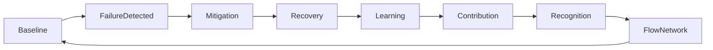

# FLOW_HUMAN_INFRASTRUCTURE_FAILURES.md
*Human Infrastructure – Failures, Conflicts, and Recovery*

---

## 1. Purpose
- This document describes **how Flow handles failures, conflicts, and unexpected scenarios**.  
- Complements:
  - [`FLOW_HUMAN_INFRASTRUCTURE.md`](./FLOW_HUMAN_INFRASTRUCTURE.md)  
  - [`FLOW_HUMAN_INFRASTRUCTURE_HWA.md`](./FLOW_HUMAN_INFRASTRUCTURE_HWA.md)  
- Audience: node participants, node leaders, Lyceum educators, external reviewers.

---

## 2. Scope
- Covers situations affecting:
  - Baseline security  
  - Task rotation (HWA)  
  - Emotional recovery (Refugium)  
  - Social Recognition System (SRS)  
  - Flow Spiral and feedback loops

---

## 3. Baseline Breach Scenarios
| Scenario | Risk | Mitigation |
|----------|------|------------|
| Refusal to participate in task rotation | Increased burden on others | Dialogue & restorative processes; temporary task reassignment; mentor support |
| Permanent non-participation | System imbalance, social friction | Pattern observation; individual support; peer circle reflection |
| Resource misuse | Resource scarcity, frustration | Transparency; peer review; SRS-linked voluntary reporting |

**Notes:**
- Baseline is non-negotiable; no access should be revoked.  
- Failures trigger **support-focused interventions**, never punitive measures.

---

## 4. Heavy Work Assignment (HWA) Failures
| Failure Mode | Risk | Mitigation |
|--------------|------|------------|
| Incomplete task execution | Safety hazards, workflow delays | Team oversight, pairing with experienced mentors, re-assignment of tasks |
| Safety incident | Injury or emotional trauma | Immediate first aid; peer & professional support; review and update of safety protocols |
| Misalignment of skill | Reduced efficiency, potential harm | Lyceum retraining; semi-legit supervision; rotation adjustments |

**Principles:**
- Rotation ensures no single individual bears permanent risk.  
- Mentorship is mandatory for high-risk tasks.  
- Failures are **learning opportunities**.

---

## 5. Refugium Anima – Emotional and Recovery Failures
| Issue | Risk | Mitigation |
|-------|------|------------|
| Overcrowding | Reduced effectiveness of recovery | Capacity monitoring; temporary scheduling; spatial expansion if needed |
| Dependence on refuge | Withdrawal from participation | Encouragement of gradual reintegration; peer circle guidance |
| Emotional conflict | Distress or interpersonal tension | Presence of witnesses; restorative dialogue; voluntary mediation |

**Guidelines:**
- Recovery spaces remain **consent-based and voluntary**.  
- Children and neurodivergent individuals maintain full agency.  
- Staff and peer witnesses focus on **stability and containment**, not therapy.

---

## 6. Social Recognition System (SRS) Failures
| Failure Mode | Risk | Mitigation |
|--------------|------|------------|
| Perceived unfair scoring | Demotivation, social tension | Transparent scoring; peer review; decay over time |
| Popularity bias | Inequity, exclusion | Randomized recognition prompts; focus on contribution metrics |
| Zero recognition | Isolation, frustration | Mentorship feedback; optional spotlighting; integration with node learning outcomes |

**Principles:**
- SRS is **optional and positive-only**.  
- Baseline access and rights are never affected by SRS outcomes.

---

## 7. Flow Spiral – Feedback and Verification Failures
| Scenario | Risk | Mitigation |
|----------|------|------------|
| Feedback misinterpretation | Wrong corrective action | Multi-level review; peer discussion; documentation of decisions |
| Delayed signal response | Compounded errors | Automated reminders; structured update cycles |
| Node-level conflict escalation | Inter-node miscoordination | Rapid mediation; escalation protocols; temporary local autonomy adjustments |

**Notes:**
- Feedback loops are **systemic, not punitive**.  
- Errors are data points for **system learning**, not judgment.

---

## 8. Conflict Resolution Framework
- **Dialogue-first approach**: all conflicts are addressed via structured peer discussions.  
- **Restorative principles**: focus on repairing relationships, redistributing responsibility, and preventing recurrence.  
- **Escalation hierarchy**:  
  1. Peer circle facilitation  
  2. Lyceum mediation  
  3. Node leadership review  
  4. Network-wide advisory if unresolved  

**Key Principle:** Conflict is **part of normal operation**; the goal is recovery, not punishment.

---

## 9. Lessons and Continuous Improvement
- All failures are documented in the **Flow Spiral system** for future learning.  
- Metrics tracked include:
  - Task completion rates  
  - Safety incidents  
  - Emotional support interventions  
  - SRS fairness indicators  
- Iterative adjustments are implemented locally and network-wide to **strengthen resilience**.

---

## 10. References
- [`FLOW_HUMAN_INFRASTRUCTURE.md`](./FLOW_HUMAN_INFRASTRUCTURE.md)  
- [`FLOW_HUMAN_INFRASTRUCTURE_HWA.md`](./FLOW_HUMAN_INFRASTRUCTURE_HWA.md)  
- [`REFUGIUM_ANIMA.md`](./REFUGIUM_ANIMA.md)  
- [`LYCEUM_MUSAEUM.md`](./LYCEUM_MUSAEUM.md)  
- [`SRS_AND_OPTIONAL_RESOURCE_ALLOCATION.md`](./SRS_AND_OPTIONAL_RESOURCE_ALLOCATION.md)  

---

## 11. Status and Validation
- Designed for **pilot nodes** and scalable to full network.  
- Continuous feedback cycles validate effectiveness of conflict mitigation.  
- Documentation of failures feeds back into node training and systemic improvement.

---

## 12. Core Principles Recap
- Baseline is inviolate and unconditional.  
- Work rotation, mentorship, and Lyceum training mitigate failures.  
- Recovery, emotional support, and SRS safeguards maintain well-being.  
- Feedback and learning loops **convert failures into systemic knowledge**.  
- Conflict resolution prioritizes restoration over punishment.  
- All interventions are transparent, voluntary, and focused on long-term resilience.

---

## System Integration Diagram
