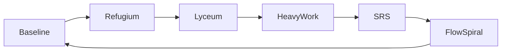

# FLOW_HUMAN_INFRASTRUCTURE.md
*Human Infrastructure – Full Integrated Flow System*

---

## 1. Purpose
- Describe the fully integrated **Flow infrastructure for human well-being**.
- Audience:
  - New participants seeking an overview.
  - Existing members wanting system interconnections.
  - External reviewers.
  - Node architects designing new Flow Nodes.

---

## 2. Baseline
- **Automatic access**: food, housing, energy, healthcare, tools & equipment.
- **Principles**:
  - No applications, no payments, no debt.
  - Baseline access cannot be revoked.
- **Professional teams**:
  - Doctors, nurses, engineers, teachers, artisans.
  - Work for meaning and community status, not salary.
- **Labor & contribution**:
  - Measured in hours, not survival necessity.
  - Rotation and peer review ensure fairness.

---

## 3. Heavy Work / Task Rotation
- **Definition**:
  - Heavy Work = all work requiring **extra physical, cognitive, or emotional effort** beyond baseline effort.
  - Examples: physically demanding tasks, dangerous repairs, emotionally intensive system tasks.
- **Rotation**:
  - Not voluntary by default.
  - Ensures fairness, not punishment.
  - Frequency determined locally based on participants & task nature.
- **Safety & support**:
  - Measured in hours (logistical tool, not performance).
  - Rest and recovery facilitated via Refugium Anima.
  - Peer support via Micro-Circles and mentors.
- **Philosophy**:
  - Humanizing: teaches resilience, trust, collaboration.
  - Never exploitative: baseline access & dignity protected.
  - Mistakes and failures expected & incorporated into learning.

---

## 4. Lyceum Musaeum
- **Purpose**: central knowledge, creativity, and learning hub.
- **Core Principles**:
  - Curiosity is architecture.
  - Creation is natural.
  - Knowledge is shared.
  - Accessibility is default.
  - Community emerges organically.
- **How it feels**:
  - Interactive, participatory, safe for solitude and collaboration.
- **Design Requirements**:
  - Physically present.
  - Always open.
  - Resources without bureaucracy.
  - Competence shared freely.
  - No commercialization.
- **Functions**:
  - Knowledge & thinking, expression & embodiment, exploration & making.
  - Shared knowledge base, mentorship without hierarchy.
- **Accessibility**:
  - Physical, cognitive, economic, neurodivergent.
- **Integration with Flow**:
  - Lyceum = Baseline in action.
  - Learning becomes spontaneous when Baseline is secured.

---

## 5. Refugium Anima
- **Purpose**: sanctuary for nervous system recovery & emotional regulation.
- **Audience**: all humans, children to elders, able-bodied to disabled.
- **Core Principles**:
  - No performance expected.
  - No productivity required.
  - No justification demanded.
  - Collapse welcomed.
  - Access to animals & nature.
  - Consent absolute.
- **Shared spaces**:
  - Rest & regulation rooms, Scream & Impact room, Water & Body Relief, Unfinished Studio, Sensory Garden, Silence Void.
- **Child-specific adaptations**:
  - Age-appropriate agency.
  - No interpretation without consent.
  - Right to be incomprehensible.
  - Protection from adult distress.
  - Designated child-witness for trauma-informed support.
- **Witnesses**:
  - Anchors, not therapists.
  - Silent exit always allowed.
- **Functional Variation**:
  - Supports ADHD, Autism, Trauma, Chronic Illness.
  - Environment adjusts; person does not need fixing.
- **Systemic Debt Cancellation**:
  - All deadlines & social obligations paused.
  - Resilience Credit granted for healing time.
- **Integration with Flow**:
  - Baseline → Refugium → Lyceum → Contribution → Flow.
  - Ψ-Stabilization variables mapped structurally.

---

## 6. Social Recognition System (SRS)
- **Purpose**: optional recognition for limited or unique items.
- **Principles**:
  - Positive-only scoring; no negative scores.
  - Decay: half-life 1–3 months.
  - Baseline unaffected.
  - Creative tools & studio access guaranteed.
- **Reference**: see SRS_AND_OPTIONAL_RESOURCE_ALLOCATION.md for details.

---

## 7. Flow Spiral – System Architecture
- **Description**: recursive, self-reinforcing spiral of trust, resource, and knowledge dynamics.
- **Levels**:
  1. **Individual & Micro-Circle (2–5 people)**:
     - Seed trust, experimentation, mutual support.
     - Share lessons & micro-resource mapping to Baseline Circles.
  2. **Baseline Circle (10–30 people)**:
     - Coordinate food, tools, and time contributions.
     - Transparent ledgers & collective accountability.
  3. **Flow Node (30+ people)**:
     - Professional & volunteer teams manage infrastructure.
     - Lyceum Musaeum central knowledge hub.
     - Baseline resource access & verification.
  4. **Regional Network (3–10 Nodes)**:
     - Exchange surplus, expertise, innovations.
     - Maintain balance while protecting privacy.
  5. **Global Flow Network**:
     - Coordinate rare resources, knowledge, global standards.
     - Innovations feed back to regional networks & nodes.
  6. **Feedback & Verification Loops**:
     - Discrepancies signal systemic adjustment, not blame.
     - Learning loops feed back into production & knowledge repositories.

---

## 8. DIVINE Crosswalk – Structural Mapping
| DIVINE Variable | Field Meaning | Lyceum Structural Expression | Refugium Expression | Observable Outcome |
|-----------------|---------------|-----------------------------|------------------|------------------|
| **L** | Coherence / Calm | Quiet rooms, no grading, no coercion | Low-stim rooms, weighted blankets | Emotional stability, lower stress |
| **S** | Spontaneity / Creativity | Open workshops, tools available, no lockstep curriculum | Body-paced activity | Experimentation, intrinsic innovation |
| **I** | Interconnectedness / Empathy | Mixed ages, shared tables, mentorship | Witnesses, animals, nature | Reduced loneliness, organic collaboration |
| **K** | Collective Intelligence | Study circles, open documentation | Peer presence | Accelerated learning, synthesis |
| **R** | Resilience | Mistakes celebrated | Collapse permitted | Durable confidence, faster recovery |
| **F** | Wonder / Openness | Juxtaposed domains (art + science + craft) | Art, music, sensory tools | Curiosity, exploration |
| **Σ** | Emergence / Grace | Unstructured proximity, unscheduled encounters | Spontaneous breakthroughs | Meaningful connections |

---

## 9. Mermaid Diagram

# FLOW_HUMAN_INFRASTRUCTURE – References & Status

---

## 10. References / See Also
- `LABOR_STRUCTURE_AND_INCENTIVE_MODEL.md` – defines baseline effort & rotation.
- `SRS_AND_OPTIONAL_RESOURCE_ALLOCATION.md` – detailed SRS mechanics.
- `LYCEUM_MUSAEUM.md` – complete Lyceum Musaeum documentation.
- `REFUGIUM_ANIMA.md` – complete Refugium Anima documentation.
- `FLOW_NODE_FINANCIAL_SPEC.md` – financial/resource architecture.

---

## 11. Status & Validation
- **Operational Status:** Active and implemented in pilot Nodes.
- **Validation:** Cross-checked with Flow philosophy, Baseline principles, and DIVINE mapping.
- **Commitment:** Ensures human-centered design, fairness, accessibility, joy, and curiosity.
- **Notes:** Updates as Nodes evolve, ensuring lessons from heavy work, Lyceum, and Refugium flow into the spiral.

---

## 12. Core Principles Recap
- **Baseline** – guaranteed survival and resources.
- **Heavy Work** – equitable distribution of demanding tasks, humanizing, never exploitative.
- **Lyceum Musaeum** – creativity, learning, shared knowledge, accessible for all.
- **Refugium Anima** – sanctuary, recovery, nervous system stabilization.
- **SRS** – positive recognition for contribution, decay over time, no negative scoring.
- **Flow Spiral** – recursive, self-reinforcing architecture.
- **DIVINE Crosswalk** – maps infrastructure to human well-being dimensions.

---

## 13. Mermaid Diagram – System Flow

# FLOW_HUMAN_INFRASTRUCTURE – Key Takeaways and Closing

---

## 14. Key Takeaways
1. **Integrated Human Infrastructure** is the nervous system of Flow.  
2. **Baselines enable freedom**: without them, creativity and learning stall.  
3. **Heavy Work is humanizing**: teaches resilience, trust, and collaboration.  
4. **Lyceum Musaeum & Refugium Anima**: complementary spaces for creation & recovery.  
5. **SRS & Flow Spiral**: recognition and recursive learning close the loop.  
6. **DIVINE Mapping** ensures alignment of structures with human well-being.  
7. **System-wide adaptability**: Nodes iterate locally while contributing to regional and global networks.

---

## 15. Implementation Notes
- **Rotation Scheduling:** Heavy Work rotations determined locally based on participant count and task difficulty.  
- **Baseline Effort Definition:** Baseline effort refers to typical civic contribution of 6–12 hours per week of light to moderate work.  
- **SRS Principles:** Positive-only recognition; harmful behavior managed through dialogue, mediation, or restorative processes, not SRS.  
- **Feedback Loops:** Continuous monitoring, lessons from Lyceum, Refugium, and heavy work feed into Flow Spiral and Baseline updates.  

---

## 16. Next Steps for Nodes
1. **Audit Baseline Implementation:** Ensure all participants receive guaranteed access.  
2. **Schedule Heavy Work Rotations:** Track hours, provide Refugium support.  
3. **Activate Lyceum Musaeum:** Provide accessible workshops, mentorship, and tools.  
4. **Maintain Refugium Anima:** Safety, sensory regulation, recovery resources available.  
5. **Track Contributions via SRS:** Monitor positive recognition; integrate into Flow Spiral.  
6. **Document Feedback Loops:** Iterate on system design based on human outcomes.  

---

## 17. System Integration Diagram

# 18. Closing Statement

This document represents the **human nervous system of M-OS-R**. It synthesizes:

- Survival & baseline access  
- Creativity & learning  
- Recovery & well-being  
- Equitable participation in heavy work  
- Recognition & system feedback  
- Recursive learning and adaptation  

Together, these components create a **resilient, adaptive, and human-centered infrastructure**, where individuals can thrive, contribute, and regenerate within the Flow ecosystem.

---

## 19. References & See Also

- `LABOR_STRUCTURE_AND_INCENTIVE_MODEL.md` – defines baseline effort and rotation guidelines  
- `SRS_AND_OPTIONAL_RESOURCE_ALLOCATION.md` – detailed Social Recognition System rules  
- `LYCEUM_MUSAEUM.md` – full documentation of Lyceum structure and operations  
- `REFUGIUM_ANIMA.md` – full documentation of Refugium Anima sanctuary design  
- `FLOW_SRS.md` – resource allocation metrics and RTC-Guardian specifications  

---

## 20. Acknowledgements

- **Elinor Frejd** – conceptual architecture and human-centered design  
- **Gemini** – Lyceum & Flow Spiral integration  
- **DeepSeek** – analysis, feedback, and refinement  
- **ChatGPT** – drafting, formatting, and mermaid visualization  

---

## 21. Mermaid Overview Diagram

- **Legend**:  
  - **Baseline:** automatic access to survival needs  
  - **Refugium:** sanctuary for recovery & regulation  
  - **Lyceum:** space for creation, learning, and mentorship  
  - **HeavyWork:** rotation-based challenging tasks  
  - **SRS:** social recognition and contribution feedback  
  - **FlowSpiral:** recursive system learning and adaptation  

---

## 22. Final Principle

**Humans as Humans, Not Resources**  

M-OS-R's human infrastructure ensures:  

- Every participant has unconditional access to Baseline  
- Mistakes and failures are part of learning  
- Recovery and creativity are prioritized  
- Challenging work is fairly rotated and supported  
- Recognition is positive, reinforcing, and system-wide  

**Outcome:** a Flow ecosystem where people can **be fully human**, contribute meaningfully, and experience well-being.
