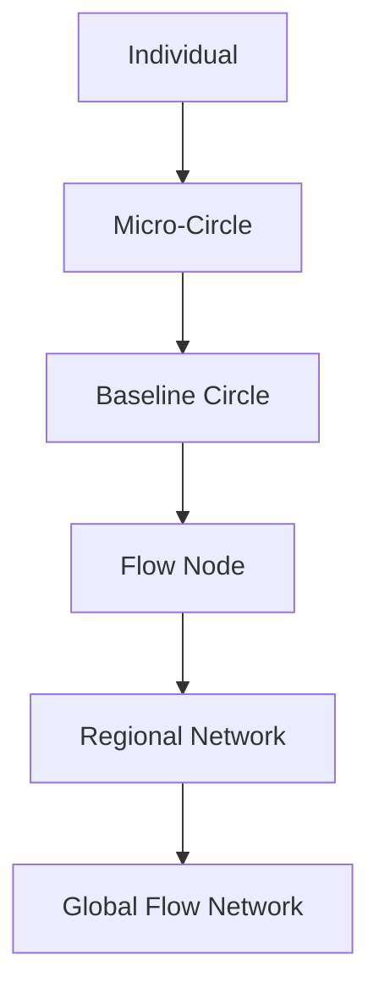
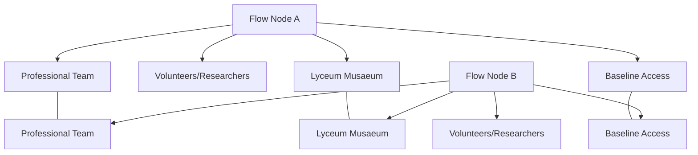

# FLOW MASTER ARCHITECTURE

**Status:** Consolidated Reference
**Purpose:** Complete structural overview of Flow, integrating Nodes, Circles, Lyceum Musaeum, Baseline, resource flows, verification, and governance.
**Audience:** All Flow participants, designers, coordinators, and new Nodes.

## 1. Core Philosophy

Flow is a depersonalized, trust-based, self-correcting societal system.

Human scale and autonomy are preserved at the center, complexity and coordination increase radially.

Knowledge, resources, and verification are integrated into a breathing spiral, not a rigid hierarchy.

### Key Principles:

* Baseline security for all
* Contribution motivated by meaning, mastery, and community
* Transparent and anonymized verification
* Voluntary participation and learning
* Resource flows are tracked without currency or personal surveillance

## 2. Radial Spiral Structure

### Layers:

| Layer | Name | Scale | Function |
| :--- | :--- | :--- | :--- |
| 0 | Individual | 1 person | Voluntary contribution, curiosity, trust formation |
| 1 | Micro-Circle | 2–5 people | Informal collaboration, experimentation |
| 2 | Baseline Circle | 10–30 people | Structured mutual aid, resource coordination |
| 3 | Flow Node | 30+ people | Full infrastructure, professional teams, Lyceum Musaeum, Baseline access |
| 4 | Regional Network | 3–10 Nodes | Inter-node balancing, specialization, resource surplus redistribution |
| 5 | Global Flow Network | Multiple regions | Rare resources, global knowledge, planetary coordination |

### Diagram (Concentric Spiral Overview):



## 3. Node Architecture

### Components:
* **Professional Team:** Healthcare, legal, technical support
* **Volunteer / Research Team:** Mentorship, innovation, arts, science
* **Lyceum Musaeum:** Knowledge, workshops, labs, library
* **Baseline Resource Access:** Food, energy, tools, healthcare
* **Governance:** Sociocratic circles, rotating committees, Axiom-based decision-making

### Node Interconnections:


## 4. Resource Flow & Coordination

### Local Node:

* Direct allocation from Baseline
* Automatic ledger logs resources anonymously
* Lyceum, workshops, and professional teams integrated

### Regional (15% of production):

* Nodes exchange surplus
* Coordinated by regional node algorithms
* Direct reciprocity, no currency

### Global (5% of production):

* Rare resources and specialty goods
* Global Flow Network tracks flows and balances
* Transparency without surveillance

### Tracking Table:

| Level | Function | Mechanism | Principle |
| :--- | :--- | :--- | :--- |
| Local | Supply essentials | Ledger + dashboard | Privacy-preserving transparency |
| Regional | Balance flows | Coordination algorithms | Reciprocity without money |
| Global | Specialty resources | Global Flow Network | Traceable, equitable exchange |
| Professionals | Maintain quality | Peer review & recognition | Status + meaning, not salary |
| Participation | Encourage work | Soft social nudges | Voluntary contribution |

## 5. Verification & Flow Integrity

* Automatic flagging for discrepancies
* Peer verification networks for neutral auditing
* Root-cause analysis (Technical / Process / Environmental / Intentional)
* Escalation Ladder: Transparent accountability → Witnessed exchange → Restricted exchange → Node exclusion (last resort)
* Discrepancies treated as learning opportunities


## 5. Verification & Flow Integrity
* Automatic flagging for discrepancies.
* Peer verification networks for neutral auditing.
* Root-cause analysis (Technical / Process / Environmental / Intentional).
* **Escalation Ladder:** Transparent accountability → Witnessed exchange → Restricted exchange → Node exclusion (last resort).
* Discrepancies treated as learning opportunities.

## 6. Lyceum Musaeum
* Free access for Node members.
* Workshops, labs, seminars, cultural activities.
* Integration with local production and professional teams.
* Supports skill-building, creativity, knowledge sharing, mentorship.
* Digital and physical accessibility.

## 7. No-Currency Economic Model
* Baseline guarantees essentials.
* Contribution for meaning, mastery, and community status.
* Local, regional, global exchanges based on direct resource swaps.
* Professional work motivated by status + meaning, not salary.
* Soft social nudges replace coercion.

## 8. Governance Principles
* Mistakes are honored and documented for learning.
* Consent-based, sociocratic decision-making.
* Voluntary participation in all processes.
* Accessibility and equity prioritized.
* Nodes and Circles follow `EXIT_AND_COMPOST.md` for graceful transition.

## 9. Production & Specialization
* **Food:** 80% local, 15% regional, 5% global.
* **Energy:** 70% local renewable, 25% regional, 5% global strategic reserve.
* **Materials:** Biodegradable, reusable, modular tools.
* **Healthcare & Social Services:** Professionals ensure quality, volunteers augment.
* **Knowledge & Innovation:** Lyceum Musaeum facilitates creation and open-source dissemination.

## 10. Integration & Global Flow
* Nodes form a resilient mesh network.
* Regional hubs for coordination and specialization.
* Global Flow Network ensures rare resource distribution, knowledge exchange, and crisis management.
* System scales organically while preserving human scale at the center.

```
%% FLOW One-Page Map: Spiral, Nodes, Lyceum, Baseline & Resource Flows
flowchart TD
    %% Individuals & Micro-Circles
    IND[Individual] --> MC[Micro-Circle<br>2-5 people] 
    MC --> BC[Baseline Circle<br>10-30 people]
    BC --> FN[Flow Node<br>30+ people]

    %% Node Internal Structure
    FN --> PT[Professional Team]
    FN --> VT[Volunteer/Research Team]
    FN --> LY[Lyceum Musaeum]
    FN --> BL[Baseline Resource Access]

    %% Inter-Node Connections
    FN --- FN2[Flow Node B] 
    FN --- FN3[Flow Node C]

    BL --- BL2[Baseline B]
    BL2 --- BL3[Baseline C]
    BL3 --- BL

    PT --- PT2[Professional B]
    PT2 --- PT3[Professional C]
    PT3 --- PT

    LY --- LY2[Lyceum B]
    LY2 --- LY3[Lyceum C]
    LY3 --- LY

    %% Regional & Global Layers
    FN --> REG[Regional Network<br>3-10 Nodes]
    REG --> GLOB[Global Flow Network<br>Multiple Regions]

    %% Legends
    classDef individual fill:#e0f7fa,stroke:#00796b,stroke-width:2px;
    classDef circle fill:#fff9c4,stroke:#fbc02d,stroke-width:2px;
    classDef node fill:#c8e6c9,stroke:#388e3c,stroke-width:2px;
    classDef team fill:#bbdefb,stroke:#1976d2,stroke-width:2px;
    classDef lyceum fill:#d1c4e9,stroke:#512da8,stroke-width:2px;
    classDef baseline fill:#ffcdd2,stroke:#c62828,stroke-width:2px;
    classDef network fill:#ffe0b2,stroke:#ef6c00,stroke-width:2px;

    class IND individual;
    class MC,BC circle;
    class FN,FN2,FN3 node;
    class PT,PT2,PT3,VT team;
    class LY,LY2,LY3 lyceum;
    class BL,BL2,BL3 baseline;
    class REG,GLOB network; 
```

---
**Status:** Master Reference – Comprehensive Flow Architecture
**Review Cycle:** Annual or upon major structural update
**Oath:** Preserve autonomy, transparency, trust, and resilience