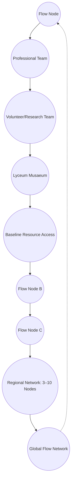

```mermaid
graph TD

%% FLOW SPIRAL – GITHUB COMPATIBLE

A((Flow Node)) --> B((Professional Team))
B --> C((Volunteer/Research Team))
C --> D((Lyceum Musaeum))
D --> E((Baseline Resource Access))

E --> F((Flow Node B))
F --> G((Flow Node C))

G --> H((Regional Network: 3–10 Nodes))
H --> I((Global Flow Network))

%% OPTIONAL LOOP BACK FOR SPIRAL FEEL
I -.-> A
```
