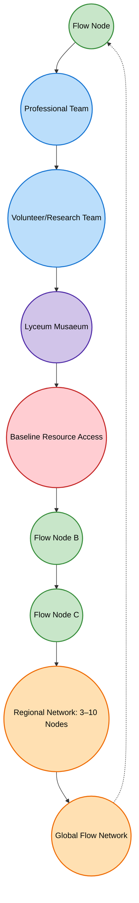

```mermaid
graph TD

%% FLOW SPIRAL – GitHub Compatible with Colors

%% Nodes
A((Flow Node)):::node --> B((Professional Team)):::team
B --> C((Volunteer/Research Team)):::team
C --> D((Lyceum Musaeum)):::lyceum
D --> E((Baseline Resource Access)):::baseline

E --> F((Flow Node B)):::node
F --> G((Flow Node C)):::node

G --> H((Regional Network: 3–10 Nodes)):::network
H --> I((Global Flow Network)):::network

%% OPTIONAL LOOP BACK FOR SPIRAL FEEL
I -.-> A

%% COLOR CLASSES
classDef node fill:#c8e6c9,stroke:#388e3c,stroke-width:2px,color:#000;
classDef team fill:#bbdefb,stroke:#1976d2,stroke-width:2px,color:#000;
classDef lyceum fill:#d1c4e9,stroke:#512da8,stroke-width:2px,color:#000;
classDef baseline fill:#ffcdd2,stroke:#c62828,stroke-width:2px,color:#000;
classDef network fill:#ffe0b2,stroke:#ef6c00,stroke-width:2px,color:#000;
``` 
