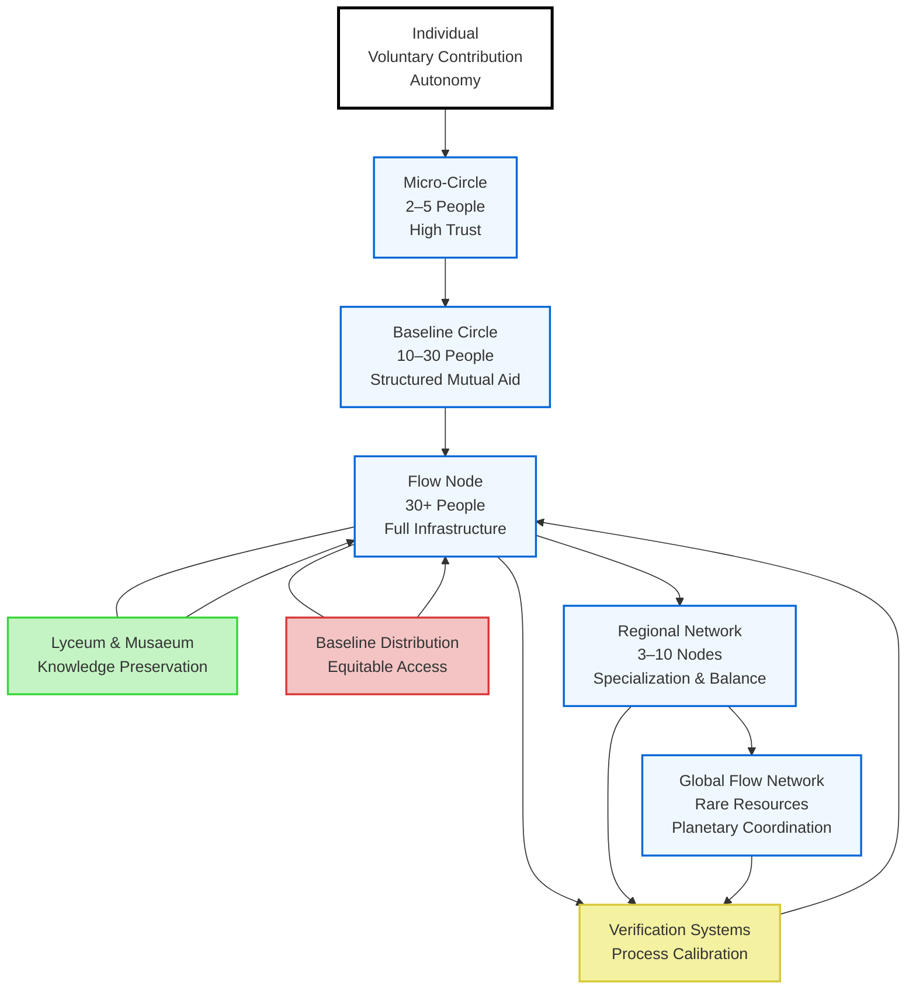

# Flow Spiral – Radial Concentric Architecture

**Filename suggestion:** `flow_spiral_radial_max.md`

---

# Flow Spiral – Radial Concentric Architecture

## Executive Overview

The Flow Spiral is a **multi-scalar, privacy-preserving, self-correcting societal architecture**.  
It is designed as a concentric, expanding spiral where each layer represents increasing structural complexity, coordination capacity, and systemic resilience.

Unlike a linear hierarchy, this system:

- Expands outward through trust and capability
- Feeds knowledge and corrections inward
- Preserves individual autonomy at all levels
- Uses verification as systemic calibration, not punishment
- Integrates learning, production, and distribution into a unified feedback organism

The spiral expands.  
But it also breathes.

---

# Core Structural Logic

The spiral has:

• A **center of origin** (Individual consciousness and voluntary contribution)  
• Expanding **coordination layers** (Micro → Baseline → Node → Regional → Global)  
• Bidirectional feedback loops  
• Distributed verification  
• Embedded knowledge preservation  

Each outer layer increases:

- Resource diversity  
- Complexity of coordination  
- Redundancy  
- Resilience  

Each inner layer preserves:

- Trust  
- Meaning  
- Human scale  
- Voluntary engagement  

---

# Layer 0 – Individual (Center of Spiral)

The individual is the origin point.

The system does not track individuals.
It enables individuals.

The spiral begins with:

- Voluntary contribution
- Curiosity
- Local trust formation
- Personal accountability
- Non-monetary motivation

No structural dependency exists at this level.
Only participation.

---

# Layer 1 – Micro-Circle (2–5 people)

Purpose:
Low-risk collaboration and experimentation.

Characteristics:
- Informal
- High trust density
- Minimal bureaucracy
- Emotional cohesion

Functions:
- Test ideas
- Share small resources
- Develop collaborative literacy
- Surface early patterns

Output:
Lessons and practices migrate outward into Baseline Circles.

---

# Layer 2 – Baseline Circle (10–30 people)

Purpose:
Structured mutual aid and transparent coordination.

Characteristics:
- Shared resource mapping
- Open ledgers (non-personal)
- Collective conflict resolution
- Clear participation expectations

Functions:
- Food/tool/time coordination
- Basic logistics stabilization
- Trust formalization
- Entry path to Node participation

Verification:
Handled socially and transparently.
Systemic adjustment > personal blame.

---

# Layer 3 – Flow Node (30+ people)

Purpose:
Full ecosystem activation.

A Node contains:

• Professional Teams (infrastructure & essential services)  
• Volunteer/Research Teams (innovation & experiments)  
• Lyceum & Musaeum (knowledge preservation & creation)  
• Baseline Distribution System (equitable access)  
• Verification Mechanisms  

Node Properties:

- Self-sustaining baseline provisioning
- Transparent but anonymized resource flows
- Multi-layer feedback
- Internal redundancy
- Cultural memory

Internal Loops:

Lyceum → Node → Residents  
Baseline → Node → Residents  
Verification → Process Adjustment → Lyceum Documentation  

Nodes are resilient organisms.

---

# Layer 4 – Regional Network (3–10 Nodes)

Purpose:
Inter-node balancing and specialization.

Characteristics:
- Resource surplus redistribution
- Skill and knowledge exchange
- Aggregated metrics (non-personal)
- Crisis redundancy

Functions:
- Specialization clustering
- Infrastructure collaboration
- Regional resilience planning

Verification escalates here only when systemic.

Learning propagates horizontally across Nodes.

---

# Layer 5 – Global Flow Network

Purpose:
Rare resource coordination and planetary knowledge exchange.

Characteristics:
- Traceable material flows
- Reciprocity instead of currency
- Global standards through consensus
- Cultural exchange and archival continuity

Functions:
- High-tech component exchange
- Rare material balancing
- Global innovation diffusion
- Long-term ecological coordination

Global flows always feed back to strengthen Regions and Nodes.

---

# System-Wide Feedback Architecture

Verification exists at all layers:

Local → Node  
Node → Regional  
Regional → Global  

Principles:

- Detect patterns, not persons
- Correct flows, not identities
- Preserve dignity
- Document improvements
- Return improvements inward

Every correction strengthens the spiral.

---

# Energy & Knowledge Dynamics

The spiral is powered by:

Contribution → Recognition → Mastery → Meaning  

Knowledge is never external to production.
Learning is never separated from logistics.
Verification is never separated from care.

---

# Spiral Resilience Properties

The system can:

- Contract without collapse
- Expand without destabilizing
- Restart locally
- Isolate failures
- Scale organically

Failure at outer layers does not destroy the center.

---

# Radial Concentric Spiral Diagram

### Final Structural Interpretation

This is not a hierarchy.
It is:
A breathing spiral. A distributed organism. A recursive learning civilization.
The center remains human.
The outer rings remain accountable.
And the spiral never closes. It only evolves.