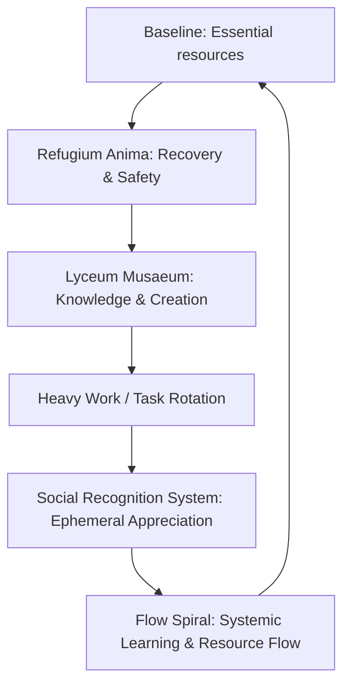

# FLOW_HUMAN_INFRASTRUCTURE.md

## Comprehensive Human-Centered Flow, Lyceum Musaeum, Refugium Anima, Heavy Work, and Systemic Rotation

---

### 1. PURPOSE
This document describes the fully integrated Flow infrastructure for human flourishing, combining:

* **Baseline:** unconditional access to essential resources.
* **Lyceum Musaeum:** knowledge, creation, and skill development nodes.
* **Refugium Anima:** sanctuary for regulation, recovery, and emotional safety.
* **Heavy Work / Task Rotation:** equitable distribution of physically and emotionally demanding work.
* **Social Recognition System (SRS):** lightweight, ephemeral acknowledgment.
* **Flow Spiral:** recursive, self-reinforcing system connecting individuals, Nodes, regions, and global network.

---

### 2. BASELINE

#### 2.1 Automatic Access
Every individual automatically receives:
* **Food** (via local Node distribution, hydroponics where possible).
* **Housing** (Node architecture).
* **Energy** (local renewable production).
* **Healthcare** (professional teams).
* **Tools & equipment** (Lyceum workshops).

> **Core Mandate:** No applications, no payments, no debt. Baseline access cannot be revoked.

#### 2.2 Professional Teams
* Professionals (doctors, nurses, engineers, teachers, artisans) work for meaning and community status, not salary.
* Education is free (Lyceum + integrated universities).
* Peer review and Node oversight maintain quality.
* Rotation ensures fairness and distributed expertise.

#### 2.3 Labor Structure
* All capable adults participate in Node maintenance via time-based civic contribution.
* Professionals operate within certified tracks and are exempt from some rotational duties.
* Labor measured in contribution hours for planning, not for survival access.
* Baseline remains unconditional.

---

### 3. HEAVY WORK / TASK ROTATION

#### 3.1 Principle
Heavy Work is all work that requires extra physical, cognitive, or emotional effort.
* Tasks rotate to distribute load fairly among participants.
* Teams mix experienced and new participants.
* Respect for capacity, pace, and health is essential.
* Backup and support always available.

#### 3.2 Examples of Heavy Work
* Sanitation and waste management.
* Hazardous repairs (electricity, machinery).
* Night shifts, on-call duties.
* Emotionally demanding system work (e.g., regulating communal spaces, high-stress events).
* Any work that is recognized as requiring more than baseline effort.

#### 3.3 Key Guidelines
* **Not voluntary by default:** Rotation ensures fairness, not punishment.
* **Measured in hours:** Tasks tracked for logistics, not as performance evaluation.
* **Accompanied by recovery:** Access to Refugium Anima before, during, or after heavy work.
* **Peer support:** Micro-circles and mentors provide oversight, guidance, and safety.

#### 3.4 Philosophy
* Heavy work is humanizing: teaches resilience, trust, and collaboration.
* It is never exploitative: baseline access and dignity are protected.
* Mistakes and failures are expected and incorporated into learning.
* All tasks return value to the community, not to individuals for status or wealth.

---

### 4. LYCEUM MUSAEUM – KNOWLEDGE, SKILLS, AND COMMUNITY
The Lyceum Musaeum functions as the cognitive and creative engine of the Node. It is a space for:
* Unrestricted exploration of arts, sciences, and crafts.
* Open-source knowledge sharing and archival.
* Mentorship-based learning without hierarchical grading.
* Community production and prototyping.

---

### 5. REFUGIUM ANIMA – SANCTUARY OF THE SOUL
The Refugium Anima is the emotional and neurological stabilizer of the system.
* Dedicated spaces for deep rest, sensory regulation, and processing.
* Trauma-informed support and witness-bearing.
* A "no-performance" zone where productivity is not expected.
* Integration of nature, animals, and silence.

---

### 6. SOCIAL RECOGNITION SYSTEM (SRS)
* Small, ephemeral recognition tokens.
* Peer-to-peer, symbolic, circulates, decays.
* Baseline access unaffected.
* Primary allocation: 70% lottery/rotation, 30% SRS.
* Must never become popularity, ranking, or economic mechanism.
* Positive only, no negative scoring.

---

### 7. FLOW SPIRAL – SYSTEMIC ARCHITECTURE
The Flow Spiral is the recursive logic that ensures the system learns from itself.
* **Individual:** Personal growth and autonomy.
* **Node:** Local resource management and community.
* **Region:** Logistics and inter-node coordination.
* **Global:** Knowledge exchange and planetary health.

---

### 8. DIVINE CROSSWALK (LYCEUM & REFUGIUM)

| Variable | Meaning | Lyceum Expression | Refugium Expression |
| :--- | :--- | :--- | :--- |
| **L** | Coherence / Calm | Quiet rooms, no grading | Weighted blankets, low-stim rooms |
| **S** | Spontaneity / Creativity | Open workshops | Body-paced activity |
| **I** | Interconnectedness / Empathy | Mixed ages, shared tables | Witnesses, animals, nature |
| **K** | Collective Intelligence | Study circles, shared archives | Peer presence |
| **R** | Resilience | Mistakes celebrated | Collapse permitted |
| **F** | Wonder / Openness | Art + science juxtaposition | Sensory tools, music |
| **Σ** | Emergence / Grace | Unscheduled encounters | Spontaneous breakthroughs |

---

### 9. MERMAID DIAGRAM




```
flowchart TB
    %% INDIVIDUAL & MICRO-CIRCLE LEVEL
    subgraph Micro["Micro-Circle (2–5 people)"]
        MC1[Individual: Trust, Experiment, Collaboration] --> MC2[Micro-Circle Resource & Knowledge Sharing]
        MC2 --> MC3[Feedback to Baseline Circle]
    end

    %% BASELINE CIRCLE LEVEL
    subgraph BaselineCircle["Baseline Circle (10–30 people)"]
        BC1[Coordinate food, tools, time] --> BC2[Conflict resolution via baseline protocols]
        BC2 --> BC3[Prepare for Node integration]
        MC3 --> BC1
    end

    %% FLOW NODE LEVEL
    subgraph Node["Flow Node (30+ people)"]
        FN1[Professional Teams: essential infrastructure] --> FN2[Volunteer/Research Teams: experimental flows]
        FN2 --> FN3[Lyceum Musaeum: Knowledge & Culture]
        FN3 --> FN4[Refugium Anima: Recovery & Regulation]
        FN4 --> FN5[Heavy Work: Task Rotation & Resilience]
        FN5 --> FN6[SRS: Social Recognition System]
        FN6 --> FN7[Internal Verification & Feedback Loops]
        BC3 --> FN1
    end

    %% REGIONAL NETWORK LEVEL
    subgraph Regional["Regional Network (3–10 Nodes)"]
        RN1[Exchange surplus materials] --> RN2[Share expertise and innovations]
        RN2 --> RN3[Aggregate lessons from Node verification]
        FN7 --> RN1
    end

    %% GLOBAL FLOW NETWORK LEVEL
    subgraph Global["Global Flow Network"]
        GF1[Coordinate rare resources & specialized knowledge] --> GF2[Set global standards & protocols]
        GF2 --> GF3[Feed back into Regional Networks and Nodes]
        RN3 --> GF1
    end

    %% FEEDBACK LOOPS
    GF3 --> RN3
    RN3 --> FN7
    FN7 --> BC3
    BC3 --> MC3
    MC3 --> MC1

    %% ADDITIONAL HUMAN SYSTEMS
    style MC1 fill:#f9f,stroke:#333,stroke-width:1px
    style FN3 fill:#9f9,stroke:#333,stroke-width:1px
    style FN4 fill:#9ff,stroke:#333,stroke-width:1px
    style FN5 fill:#ff9,stroke:#333,stroke-width:1px
    style FN6 fill:#fc9,stroke:#333,stroke-width:1px

    %% LEGEND
    classDef legend fill:#eee,stroke:#333,stroke-width:1px;
    class legendNode legend;
    legendNode[Legend: MC=Micro-Circle, BC=Baseline Circle, FN=Flow Node, RN=Regional Network, GF=Global Flow Network] 
```
